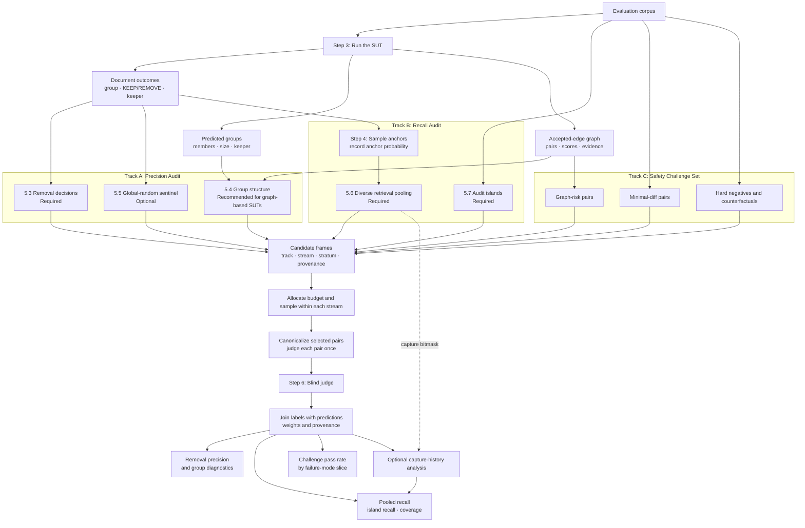

# Step 5 — Candidate Construction and Sampling

This step builds judge-ready document pairs for three separate purposes:

- **Track A — Precision audit:** Are the system's merge and removal decisions safe?
- **Track B — Recall audit:** Which true duplicates did the system miss?
- **Track C — Safety challenge set:** Does the system preserve hard negatives and other known failure cases?

The three tracks use different sampling frames and answer different questions. Their raw judgment counts must not be combined into one confusion matrix.

In this document, **SUT** means *system under test*: one deduplication method with one fixed configuration, such as Fuzzy MinHash at a specified threshold or SemDedup with a specified embedding model and threshold.

## 5.1 Inputs from Step 3

Step 3 must retain the SUT's operational decisions, not only `predicted_group_id`.

### Run metadata

Store method-level information once per run:

| Field | Status | Meaning and use |
|---|---|---|
| `run_id` | Required | Unique identifier referenced by all output tables. |
| `method_name` | Required | For example, `fuzzy_minhash` or `semdedup`; used to compare SUTs. |
| `method_config` | Required | Thresholds, shingle definition, embedding model, and other settings needed for reproduction. |
| `normalization_version` | Required | Identifies the text normalization and parsing pipeline. |
| `dataset_version` | Required | Identifies the evaluated corpus snapshot. |

### Document outcome table

Store one row per document and SUT run:

| Field | Status | Meaning and use |
|---|---|---|
| `run_id`, `doc_id` | Required | Identifies the document and SUT run. |
| `predicted_group_id` | Required | The SUT's output group or connected component. |
| `action` | Required | `KEEP` or `REMOVE`. |
| `final_keeper_id` | Required for removal evaluation | The retained document that represents this document. For a keeper, set it to its own `doc_id`. |
| `immediate_parent_id` | Recommended for graph-based SUTs | The direct predecessor or edge that attached the document to the component, if available. |
| `removal_reason` | Recommended | A structured reason such as `EXACT_HASH_MATCH`, `DIRECT_FUZZY_EDGE`, `TRANSITIVE_COMPONENT`, or `SEMANTIC_NEIGHBOR`; used for error slicing. |
| `decision_score` | Optional and method-specific | The score actually used for a direct decision, such as Jaccard or cosine similarity; used for boundary sampling and calibration. Keep it null when no direct score exists. |

Do not invent a keeper-to-removed `decision_score` for a transitive merge. If useful, compute `keeper_removed_similarity` later as an evaluation feature and keep it separate from the score used by the SUT.

If keeper selection has its own policy, also record a structured `keeper_selection_reason`, such as `HIGHEST_QUALITY_SCORE`, `LONGEST_DOCUMENT`, or `EARLIEST_CRAWL`.

### Accepted-edge evidence table — Required for graph-based SUTs

For a graph-based SUT, retain the graph before connected components are formed. Store, when applicable:

- `doc_i`, `doc_j`, and whether the edge was accepted;
- lexical or semantic scores and the decision threshold;
- matching LSH bands or buckets;
- candidate-generation channel;
- common-neighbor or other edge-support features;
- URL, domain, and crawl-time relationships.

The final group ID alone cannot identify the edge that caused an overmerge. For example:

```text
Group G7:
d1: KEEP,   final_keeper=d1
d2: REMOVE, final_keeper=d1
d3: REMOVE, final_keeper=d1

Accepted edges:
(d1, d2)
(d2, d3)
```

The system may never have scored `(d1, d3)` directly, but removing `d3` still asserts that `d1` can safely represent it. Therefore:

- `(d1, d3)` belongs in the removal-decision audit;
- `(d2, d3)` remains available for graph-causality analysis.

## 5.2 Overall Flow



Step 4 anchors feed the retrieval pool in Track B. Track A samples directly from SUT outputs, and audit islands are sampled independently from the corpus.

## 5.3 Removal-Decision Sampling — Required

This stream estimates whether the SUT's actual removals are safe. One sampling unit is:

```text
(final_keeper, removed_document)
```

For example:

```text
G7 = {d1, d2, d3, d4}
keeper = d1
removed = {d2, d3, d4}
```

The complete removal-decision frame is:

```text
(d1, d2)
(d1, d3)
(d1, d4)
```

Stratify this frame by variables that may affect error rates, such as:

- SUT and configuration;
- language and source;
- predicted group size;
- direct score or evaluation similarity bucket;
- document length;
- URL relationship;
- distance from the SUT threshold;
- `removal_reason`.

Randomly sample within each stratum. If stratum $h$ contains $N_h$ decisions and $n_h$ are sampled, then:

$$
\pi_h = \frac{n_h}{N_h}, \qquad w_h = \frac{1}{\pi_h}
$$

The primary metric is weighted removal precision:

$$
\text{Removal Precision}
=
\frac{\sum w_{ij}\mathbf{1}(y_{ij}=\text{safe replacement})}
{\sum w_{ij}}
$$

$$
\text{Wrong Removal Rate}=1-\text{Removal Precision}
$$

Report confidence intervals and slice results in addition to the aggregate.

## 5.4 Group-Structure Sampling — Recommended for Graph-Based SUTs

This stream diagnoses overmerged groups and failures caused by transitive connected components. It is optional for a SUT that produces only independent pair decisions and no group structure.

Consider this accepted-edge graph:

```text
d1 --0.96-- d2 --0.81-- d3 --0.97-- d4
```

At the production threshold of `0.80`, all four documents form `G7`. At a stricter diagnostic threshold of `0.90`, the weak middle edge is removed, yielding two diagnostic subclusters:

```text
Subcluster A = {d1, d2}
Subcluster B = {d3, d4}
```

Examples of diagnostic pairs are:

```text
(d1, d2) — within-subcluster pair
(d3, d4) — within-subcluster pair
(d2, d3) — cross-subcluster boundary pair
(d1, d4) — cross-subcluster far pair
```

The diagnostic subclusters can be obtained by applying a stricter score or support threshold to the accepted-edge graph and recomputing connected components. Community detection is an optional extension, not a requirement.

For a large group, do not enumerate all $n(n-1)/2$ pairs for judgment. Sample a mixture of:

- random within-group pairs;
- lowest-similarity pairs;
- cross-subcluster boundary and far pairs;
- keeper-to-boundary-member pairs;
- bridge- and cut-adjacent pairs.

For two-stage sampling—first a group, then a pair within the group—record:

$$
\pi_{ij}=\pi_{\text{group}}\pi_{\text{pair}\mid\text{group}}
$$

Report this stream separately from Section 5.3. Section 5.3 estimates the safety of removal actions; Section 5.4 estimates pairwise group integrity. Even with weights, they should be combined only if a common target population and the pair's inclusion probability under the combined sampling design are explicitly defined.

## 5.5 Global-Random Sentinel — Optional

Uniformly sample a small number of unordered pairs from the full corpus pair universe:

$$
\{(i,j):i<j\}
$$

This method-independent sample provides a rough background estimate and a check on assumptions made by retrieval-based sampling. It is not the main precision or recall estimator: true duplicates are usually too rare in uniformly random pairs for a small sample to have high yield.

If the annotation budget is limited, prioritize Sections 5.3, 5.6, and 5.7. The low-low residual stratum in the audit islands already provides a more targeted background check.

## 5.6 Diverse Retrieval Pooling — Required

A **retriever** is a candidate generator: it proposes pairs worth judging but does not assign the final reference label. A fuzzy-dedup SUT may itself contain a MinHash/LSH retriever, a threshold decision rule, connected components, and a keeper policy. In this evaluation, a lower-threshold fuzzy configuration may also be used as a pool retriever, but it remains closely related to the fuzzy SUT and cannot be the only recall source.

For each Step 4 anchor, run retrievers with different inductive biases:

- exact and normalized matching;
- suffix-array or ExactSubstr retrieval;
- containment retrieval;
- word- and character-level n-gram retrieval;
- alternative MinHash configurations and SimHash;
- BM25 or TF-IDF;
- semantic embedding retrieval;
- URL, source, and crawl-time retrieval;
- alternative-parser retrieval.

For embedding retrieval, prefer a calibrated similarity threshold with adaptive $k$ over a single fixed `top_k`: return at least `k_min`, retain all candidates above the threshold, cap at `k_max`, and log truncation. Calibrate this policy on the audit islands.

Example for anchor `d100`:

```text
ExactSubstr:   d201, d305
BM25:          d201, d410
Embedding:     d305, d502
URL retrieval: d610
```

The judge-ready candidates are:

```text
(d100, d201): sources={ExactSubstr, BM25}
(d100, d305): sources={ExactSubstr, Embedding}
(d100, d410): sources={BM25}
(d100, d502): sources={Embedding}
(d100, d610): sources={URL}
```

For every pair, retain the anchor probability, retriever bitmask, scores, ranks, sampling stratum, downstream selection probability, and SUT prediction. Multi-retriever support is a useful diagnostic, but a pair found by only one retriever is not necessarily wrong; it may be a hard positive visible only to that representation.

If either endpoint can be sampled as the anchor, a simplified pair-inclusion probability is:

$$
\pi_{ij}=1-(1-p_iq_{j\mid i})(1-p_jq_{i\mid j})
$$

Here $p_i$ is the probability that document $i$ is selected as an anchor, and $q_{j\mid i}$ is the conditional probability that `(i,j)` is selected for judgment given anchor $i$.

Pooling cannot correct shared blind spots: a true duplicate missed by every retriever has zero inclusion probability in this frame. Report pooled recall as `Recall@Pool`, not as unqualified corpus recall.

After judgment, the retriever bitmask can also support coverage curves and an **optional** capture–recapture sensitivity analysis. Treat this only as an estimate of unseen positives: retrievers are dependent and duplicate types have heterogeneous capture probabilities. Incidence-based estimators such as Chao2 or multi-list models are more appropriate than a naive two-list estimate, and should be calibrated against the audit islands.

## 5.7 Complete-Frame Audit Islands — Required

Audit islands are small corpus subsets in which the complete pair frame is known. They calibrate pool bias and provide a more defensible local recall estimate.

Use a mixture of island types:

1. **Host-complete islands.** Parse the hostname from each document URL, stratify hosts by document count, randomly select hosts with known probabilities, and include every document from each selected host. For example, `https://docs.nvidia.com/cuda/...` has hostname `docs.nvidia.com`. If a host is too large, restrict it to a predefined time window or use two-stage document sampling and record both probabilities; do not call it host-complete.
2. **Temporal or source islands.** Include all documents from a bounded source and time window, or all snapshots of selected canonical URLs when crawl timestamps are available.
3. **Random cross-domain islands.** Sample several blocks of documents uniformly from the full corpus. These can expose duplicates syndicated across different hosts, which host-complete islands may miss.

For a FineWeb-style dataset, the URL field provides the hostname. If URL is unavailable, use the most specific stable source identifier retained by the dataset.

An island with 5,000 documents contains:

$$
\binom{5000}{2}=12{,}497{,}500
$$

“Complete-frame” means that every pair belongs to the sampling frame, not that every pair is sent to the judge. For every pair, compute automated features that are inexpensive relative to LLM judgment. Precompute document representations once, then calculate pair features in blocks.

Useful features include:

- normalized-text equality and length ratio;
- token or character n-gram overlap;
- MinHash-estimated Jaccard and SimHash distance;
- containment and title overlap;
- embedding cosine similarity;
- canonical-URL equality, hostname equality, and crawl-time difference;
- SUT score and distance from its threshold.

Use pilot data to define lexical and semantic cutoffs. Assign each pair to one mutually exclusive stratum using a fixed precedence rule, for example:

1. same canonical URL or temporal-update candidate;
2. SUT threshold boundary;
3. lexical-high / semantic-high;
4. lexical-high / semantic-low;
5. lexical-low / semantic-high;
6. lexical-low / semantic-low residual.

The features control sampling; they do not determine the reference label. Sample from every stratum, including the low-low residual, so every island pair has a non-zero known judgment probability.

If island $g$ is selected with probability $\pi_g$ and stratum $h$ contains $N_{gh}$ pairs of which $n_{gh}$ are judged, then a simple two-stage probability is:

$$
\pi_{ij}=\pi_g\frac{n_{gh}}{N_{gh}}
$$

Use design weights and confidence intervals to report:

- `Recall@Island` and precision within each island type;
- the gap between pooled and island recall;
- marginal and cumulative coverage by retriever;
- hard-negative and failure-mode prevalence within the island design;
- calibration of optional capture–recapture estimates.

$$
\text{Pool Bias Gap}=\text{Recall@Pool}-\text{Recall@Island}
$$

Unless every pair is labeled, do not call an island complete ground truth. The correct claim is that its complete pair frame has known non-zero judgment probabilities, enabling design-based estimates with uncertainty intervals.

## 5.8 Safety Challenge Set — Required for This Benchmark

Track C targets known high-cost failures. Because it intentionally oversamples difficult cases, report its metrics by slice and do not mix its raw counts into corpus-weighted precision or recall.

### Graph-risk pairs — Recommended for Graph-Based SUTs

Build these candidates from the SUT's accepted-edge graph. Do not sample accepted edges uniformly without first identifying risk structure.

| Risk type | Meaning | How to find it |
|---|---|---|
| Bridge | Removing the edge splits a connected component. | Run a bridge-finding algorithm and record the sizes of the two resulting sides. |
| Articulation-adjacent edge | The edge touches a document whose removal would split the component. | Find articulation points and inspect their incident edges. |
| Low-support edge | The edge has weak or isolated evidence. | Use threshold margin, matching-band count, independent evidence channels, common neighbors, and triangle support. |
| One-band collision | A MinHash pair matches in only one LSH band. | Count matching bands; interpret jointly with exact Jaccard if the SUT verifies candidates. |
| High-betweenness edge | The edge lies on many shortest paths and may connect dense regions. | Compute exact or approximate edge betweenness within large components. |
| Inter-community cut edge | The edge connects diagnostic subclusters or communities. | Apply a stricter threshold or community detection, then select cross-community edges. |

Enumerate the relevant risk frames, rank or stratify by impact, sample within risk strata, and retain a random accepted-edge baseline. A useful bridge-impact feature is:

$$
\text{Bridge Impact}=n_Ln_R
$$

where $n_L$ and $n_R$ are the component sizes after removing the bridge.

For each high-risk bridge, judge both the direct edge and cross-side witnesses:

```text
Direct edge:       (u, v)
Keeper witnesses:  (keeper_left, keeper_right)
Random witnesses:  (random_left, random_right)
Far witnesses:     (farthest_left, farthest_right)
```

This distinguishes a false bridge edge from a locally valid edge whose transitive closure still produces an unsafe global merge.

### Minimal-Diff Pairs — Required

Mine natural pairs whose overall text is nearly identical but whose small difference may be material.

Use two complementary generators:

1. **Relaxed retrieval plus alignment.** Retrieve high-surface-similarity pairs with relaxed lexical methods, align their tokens or characters, and retain pairs with one or a few small edit spans.
2. **Mask-and-match.** Replace one field type at a time—URL, number, date, entity, version, or code literal—with a placeholder, hash the masked text, and pair documents that match after masking but differ in the original field.

For example:

```text
Text A: Download CUDA 13.0 from URL_A.
Text B: Download CUDA 12.8 from URL_B.
```

Classify the changed spans as URL, number, date/time, named entity, product/version, identifier, code literal/output, negation, paragraph insertion/deletion, or boilerplate. Preserve the original text and metadata for the judge; do not erase these differences through normalization before judgment.

### Hard Negatives — Required; Synthetic Counterfactuals — Optional

Mine natural hard-negative candidates from the corpus using:

- same host and template but different entities, numbers, dates, or answers;
- high-similarity pairs that the SUT did not merge;
- disagreement between fuzzy, semantic, exact-substring, and containment methods;
- pairs close to a decision threshold;
- same canonical URL at different crawl times;
- same title with materially different body text;
- same code structure with different constants or outputs.

The original same-domain hard-negative source can be retained, but it is only one slice. Different URLs may contain the same syndicated article, while the same URL may change materially over time; URL equality is a feature, not a reference label.

**Synthetic counterfactuals are optional.** Create them by changing one material fact—such as a number, entity, date, URL target, negation, or code output—while preserving the rest of the text. Report them separately from natural pairs and never use them to estimate corpus prevalence, precision, or recall.

Track C outputs a preservation or pass rate for each failure-mode slice, together with uncertainty intervals where the slice is probability-sampled.

## 5.9 Sampling, Canonicalization, and Judgment

Build and sample each candidate frame separately before deduplicating selected pair IDs. This preserves each stream's sampling design.

Canonicalize a selected pair as:

```text
canonical_pair_id = (min(doc_i, doc_j), max(doc_i, doc_j))
```

If the same pair is selected by multiple streams, judge it once but retain every membership and probability:

```text
pair_id = (d10, d20)

selected_A53 = true
pi_A53 = 0.02

selected_B56 = true
pi_B56 = 0.004

selected_C_minimal_diff = true
pi_C_minimal_diff = null
```

Deterministic inclusion in the challenge set must not change the probability associated with a statistical stream.

For every judged pair, retain:

- canonical pair ID and document IDs;
- selected tracks and streams;
- sampling frame and stratum;
- anchor, conditional, and pair inclusion probabilities where defined;
- SUT predictions and method configuration;
- retriever source bitmask, scores, and ranks;
- URL, source, time, language, length, and parser metadata;
- graph-risk and minimal-diff features;
- natural or synthetic provenance;
- judge label, confidence, rationale code, and adjudication status.

The judge must not see the SUT prediction, candidate source, retrieval score, sampling weight, or track membership. It may see the original texts, aligned chunks, diff spans, URLs, timestamps, and other metadata needed to determine whether one document can safely replace the other.

Report the tracks separately:

- **Track A:** weighted removal precision, wrong-removal rate, and group-integrity diagnostics;
- **Track B:** `Recall@Pool`, `Recall@Island`, retriever coverage curves, and pool-bias gap;
- **Track C:** preservation or pass rate by challenge slice.

## References

- [Buckley et al., Bias and the Limits of Pooling](https://www.nist.gov/publications/bias-and-limits-pooling-large-collections)
- [Yilmaz et al., On the Reliability of Test Collections](https://arxiv.org/abs/2004.13486)
- [Li and Kanoulas, Active Sampling for Large-scale IR Evaluation](https://arxiv.org/abs/1709.01709)
- [Lee et al., Deduplicating Training Data Makes Language Models Better](https://aclanthology.org/2022.acl-long.577/)
- [Silcock et al., Noise-Robust De-Duplication at Scale](https://openreview.net/forum?id=bAz2DBS35i)
- [Abid et al., SemDeDup](https://arxiv.org/abs/2303.09540)
- [Amigó et al., B-Cubed Metrics](https://doi.org/10.1007/s10791-008-9066-8)
- [Ribeiro et al., CheckList](https://arxiv.org/abs/2005.04118)
