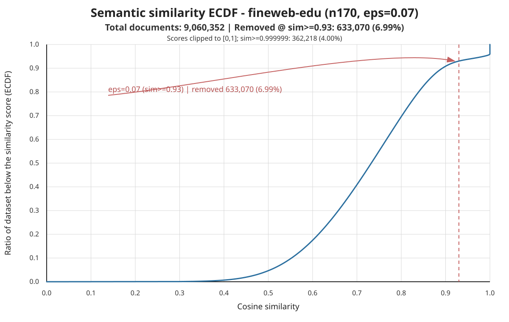

# FineWeb-EDU SemDeDup Multi-Seed Repeat Report

## Scope

Completed paired seeds: 3

This report compares FineWeb-EDU baseline vs FineWeb-EDU SemDeDup only. Pilot/smoke runs are excluded. Repeated runs share the same dataset, tokenizer, shard order, validation shard, model depth, training horizon, and CORE evaluation settings; the model seed changes by repeat.

## Common Parameters

| Parameter | Baseline | SemDeDup |
|---|---|---|
| DATASET_TAG | fineweb_edu | fineweb_edu |
| NANOCHAT_DATASET_URL | https://huggingface.co/datasets/karpathy/fineweb-edu-100b-shuffle/resolve/main | https://huggingface.co/datasets/karpathy/fineweb-edu-100b-shuffle/resolve/main |
| NANOCHAT_DATASET_MAX_SHARD | 1822 | 1822 |
| NUM_TRAIN_SHARDS | 170 | 170 |
| PARAM_DATA_RATIO | 9.5 | 9.5 |
| DEPTH | 24 | 24 |
| NUM_GPUS | 8 | 8 |
| DEVICE_BATCH_SIZE | 16 | 16 |
| SEED | varies by repeat | varies by repeat |
| CORE_EVAL_SEED | 1337 | 1337 |
| EVAL_EVERY | 250 | 250 |
| EVAL_TOKENS | 41943040 | 41943040 |
| CORE_METRIC_EVERY | 2000 | 2000 |
| CORE_METRIC_MAX_PER_TASK | 500 | 500 |
| FINAL_CORE_MAX_PER_TASK | -1 | -1 |
| BASE_EVAL_MODES | core,bpb,sample | core,bpb,sample |
| SEMD_BACKEND | curator | curator |
| SEMD_MODEL | google/embeddinggemma-300m | google/embeddinggemma-300m |
| SEMD_EPS | 0.07 | 0.07 |
| SEMD_N_CLUSTERS | 100 | 100 |
| SEMD_DISTANCE_METRIC | cosine | cosine |
| SEMD_WHICH_TO_KEEP | hard | hard |
| SEMD_PAIRWISE_BATCH_SIZE | 1024 | 1024 |

## Run-Level Results

| Seed | Baseline run | SemDeDup run | Baseline BPB | SemDeDup BPB | Delta BPB | Baseline CORE | SemDeDup CORE | Delta CORE | Delta runtime sec |
|---:|---|---|---:|---:|---:|---:|---:|---:|---:|
| 42 | full-n170-r9p5-eps0p07-20260622T192524Z_baseline | full-n170-r9p5-eps0p07-20260622T192524Z_semdedup | 0.751186 | 0.750783 | -0.000403 | 0.246800 | 0.244200 | -0.002600 | -812.400000 |
| 43 | repeat-20260624T000845Z-seed43-n170-r9p5-eps0p07_baseline | repeat-20260624T000845Z-seed43-n170-r9p5-eps0p07_semdedup | 0.751378 | 0.750818 | -0.000560 | 0.238000 | 0.247100 | 0.009100 | -538.800000 |
| 44 | repeat-20260624T000845Z-seed44-n170-r9p5-eps0p07_baseline | repeat-20260624T000845Z-seed44-n170-r9p5-eps0p07_semdedup | 0.751841 | 0.750931 | -0.000910 | 0.244400 | 0.247200 | 0.002800 | -12.000000 |

## Aggregate Paired Results

| Metric | Better | Baseline mean +/- sd | SemDeDup mean +/- sd | Paired delta mean +/- sd |
|---|---|---:|---:|---:|
| min val BPB | lower | 0.751468 +/- 0.000337 | 0.750844 +/- 0.000077 | -0.000624 +/- 0.000260 |
| final train val BPB | lower | 0.751468 +/- 0.000337 | 0.750844 +/- 0.000077 | -0.000624 +/- 0.000260 |
| base eval val BPB | lower | 0.750794 +/- 0.000327 | 0.750296 +/- 0.000076 | -0.000498 +/- 0.000251 |
| final CORE | higher | 0.243067 +/- 0.004549 | 0.246167 +/- 0.001704 | 0.003100 +/- 0.005856 |
| train runtime sec | lower | 5822.800000 +/- 440.407493 | 5368.400000 +/- 71.388234 | -454.400000 +/- 406.820059 |
| train iterations | lower | 6612.000000 +/- 0.000000 | 6612.000000 +/- 0.000000 | 0.000000 +/- 0.000000 |
| train tokens | lower | 6933184512.000000 +/- 0.000000 | 6933184512.000000 +/- 0.000000 | 0.000000 +/- 0.000000 |
| steps to paired baseline BPB | lower | 6612.000000 +/- 0.000000 | 6612.000000 +/- 0.000000 | 0.000000 +/- 0.000000 |
| runtime sec to paired baseline BPB | lower | 5822.800000 +/- 440.407493 | 5368.400000 +/- 71.388234 | -454.400000 +/- 406.820059 |

## SemDeDup Data Reduction

| SemDeDup statistic | Value |
|---|---:|
| input docs | 9,060,352 |
| output docs | 8,427,282 |
| removed docs | 633,070 |
| input tokens | 9,309,977,010 |
| output tokens | 8,534,372,009 |
| removed tokens | 775,605,001 |
| doc keep ratio | 0.930127 |
| token keep ratio | 0.916691 |
| dedup runtime sec | 875.110278 |
| embedding model | google/embeddinggemma-300m |
| eps | 0.070000 |
| n clusters | 100 |
| distance metric | cosine |
| which to keep | hard |

## SemDeDup Similarity ECDF

| ECDF statistic | Value |
|---|---:|
| total documents | 9,060,352 |
| eps | 0.070000 |
| similarity threshold | 0.930000 |
| documents below threshold | 8,427,282 |
| removed documents | 633,070 |
| removed ratio | 0.069873 |

## Per-Task CORE Delta

| CORE task | N | Delta mean | Delta sd | Min delta | Max delta |
|---|---:|---:|---:|---:|---:|
| boolq | 3 | -0.100864 | 0.067870 | -0.162563 | -0.028167 |
| openbook_qa | 3 | -0.000889 | 0.021388 | -0.021333 | 0.021333 |
| hellaswag_zeroshot | 3 | -0.000753 | 0.005818 | -0.005577 | 0.005709 |
| arc_easy | 3 | -0.000374 | 0.017033 | -0.015713 | 0.017957 |
| bigbench_cs_algorithms | 3 | -0.000252 | 0.043403 | -0.040909 | 0.045455 |
| winogrande | 3 | 0.000000 | 0.019779 | -0.018942 | 0.020521 |
| coqa | 3 | 0.000126 | 0.011730 | -0.012777 | 0.010147 |
| hellaswag | 3 | 0.000266 | 0.001956 | -0.001460 | 0.002390 |
| commonsense_qa | 3 | 0.000682 | 0.068419 | -0.063473 | 0.072687 |
| arc_challenge | 3 | 0.001138 | 0.003010 | -0.002275 | 0.003413 |
| jeopardy | 3 | 0.001574 | 0.008131 | -0.007558 | 0.008030 |
| bigbench_language_identification | 3 | 0.002897 | 0.004969 | -0.002750 | 0.006601 |
| CORE | 3 | 0.003121 | 0.005805 | -0.002522 | 0.009075 |
| squad | 3 | 0.004100 | 0.007599 | -0.004257 | 0.010596 |
| bigbench_dyck_languages | 3 | 0.004333 | 0.009292 | -0.006000 | 0.012000 |
| piqa | 3 | 0.004352 | 0.023615 | -0.022851 | 0.019586 |
| bigbench_operators | 3 | 0.004762 | 0.009523 | -0.004761 | 0.014285 |
| lambada_openai | 3 | 0.006727 | 0.007153 | -0.001359 | 0.012226 |
| bigbench_qa_wikidata | 3 | 0.007841 | 0.004742 | 0.002461 | 0.011416 |
| bigbench_repeat_copy_logic | 3 | 0.010417 | 0.018042 | 0.000000 | 0.031250 |
| copa | 3 | 0.033333 | 0.030551 | 0.000000 | 0.060000 |
| winograd | 3 | 0.043956 | 0.045751 | -0.007326 | 0.080586 |
| agi_eval_lsat_ar | 3 | 0.045290 | 0.033207 | 0.016304 | 0.081522 |

## Incomplete Or Missing Runs

All discovered repeat pairs are complete.

## Notes

- BPB is the primary convergence-efficiency metric; lower is better.
- CORE is the downstream-quality metric; interpret small average deltas together with per-task deltas and seed variance.
- The ECDF x-axis is cosine similarity. For cosine distance SemDeDup, eps maps to similarity cutoff 1 - eps.
- Manual audit files remain in each SemDeDup run directory: removed_samples.jsonl and kept_samples.jsonl. Repeated SemDeDup training runs that reuse the seed42 deduped data inherit the same data audit artifacts.
