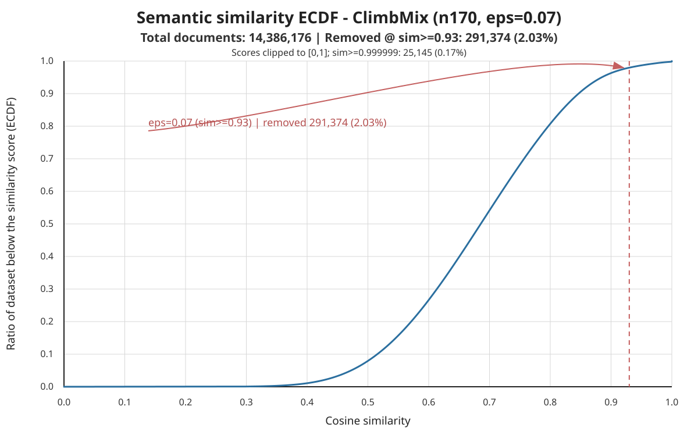

# ClimbMix SemDeDup Final Report

Report date: 2026-06-24

This is the canonical ClimbMix report for the SemDeDup quality experiment. It uses the same section structure as the FineWeb-EDU final report so the two datasets can be compared directly. Supporting details remain in `branch_report.md`, `task_delta_final_report.md`, `commonsense_qa_delta_analysis.md`, and `consolidated_final_report.md`.

## Executive Summary

SemDeDup eps0.07 on ClimbMix is not a simple win/loss result.

- It removes 291,374 train documents and 210.5M train tokens: 2.03% of docs and 2.30% of tokens.
- It does not improve BPB. In the first matched A/B run, SemDeDup is worse by +0.000600 base-eval validation BPB, where lower is better.
- Aggregate CORE is slightly higher for SemDeDup eps0.07, but the advantage is small relative to training variance: 0.2767 vs 0.2732 for baseline.
- The strongest signal is task redistribution. `commonsense_qa` improves much more under SemDeDup than under matched random-drop controls.
- Random-drop controls, eps sweep, eval-only repeats, and an order-preserving SemDeDup control were completed. The order-preserving control shows the `commonsense_qa` gain is not mainly a source-shard order artifact.
- The best current claim is cautious: SemDeDup eps0.07 changes the effective data distribution and creates interesting task-level gains, especially for `commonsense_qa`, but it does not yet demonstrate a robust aggregate quality win or a training-efficiency win.

## Dataset And Setup

| Item | Value |
| --- | --- |
| Dataset | ClimbMix parquet |
| Data root | `$HOME/.cache/nanochat_b200_climbmix` |
| Run root | `$NANOCHAT_BASE_DIR/experiments/climbmix_semdedup_quality` |
| Model | NanoChat base model |
| Depth | 24 |
| Hardware target | 8x B200 |
| Device batch size | 16 |
| Training horizon | 6,612 iterations |
| Training tokens consumed | 6,933,184,512 per full run |
| Validation | Held-out ClimbMix validation shard, not deduplicated |
| Primary convergence metric | Validation BPB, lower is better |
| Downstream metric | CORE, higher is better |
| Eval modes | `core,bpb,sample` |
| Base-only scope | No SFT or RL |

## A/B Design

The primary comparison is:

- ClimbMix baseline: original selected train shards.
- ClimbMix SemDeDup: same source shards after semantic deduplication.

Held fixed across arms:

- tokenizer and token-byte mapping;
- validation shard;
- model depth and training budget;
- base pretraining and base evaluation only;
- CORE evaluation settings where applicable.

The first A/B run used one baseline and one SemDeDup run. Follow-up analysis added eval-only repeats, full seed repeats, random-drop controls, eps sweep runs, and an order-preserving SemDeDup control.

## SemDeDup Configuration

| Parameter | Value |
| --- | --- |
| Backend | NeMo Curator semantic deduplication |
| Embedding model | `google/embeddinggemma-300m` |
| eps | 0.07 |
| Cosine similarity cutoff | 0.93 |
| n clusters | 100 |
| Distance metric | cosine |
| Which to keep | hard |
| Pairwise batch size | 1024 |
| vLLM attention backend | `TRITON_ATTN` |
| vLLM eager mode | enabled |

The validation shard is copied through unchanged and is not deduplicated.

## Data Reduction Summary

| Metric | Baseline | SemDeDup eps0.07 | Delta |
| --- | ---: | ---: | ---: |
| Train docs | 14,386,176 | 14,094,802 | -291,374 |
| Train tokens | 9,158,993,442 | 8,948,462,810 | -210,530,632 |
| Train chars | 42,783,740,697 | 41,813,755,175 | -969,985,522 |
| Doc keep ratio | 1.000000 | 0.979746 | -0.020254 |
| Token keep ratio | 1.000000 | 0.977014 | -0.022986 |
| Dedup runtime sec | - | 4,692.98 | - |

The removal rate is modest. It is large enough to change task composition, but not large enough to be a meaningful training-cost reduction by itself.

## Similarity ECDF



| ECDF statistic | Value |
| --- | ---: |
| total documents | 14,386,176 |
| eps | 0.070000 |
| similarity threshold | 0.930000 |
| documents below threshold | 14,094,802 |
| removed documents | 291,374 |
| removed ratio | 0.020254 |
| raw max similarity | 1.000002 |
| raw >1.0 documents | 12,684 |
| raw >1.0 ratio | 0.000882 |
| raw ==1.0 documents | 2,344 |
| sim >=0.999999 documents | 25,145 |
| sim >=0.999999 ratio | 0.001748 |

The x-axis is cosine similarity. With cosine distance, eps maps to similarity cutoff `1 - eps`. Raw Curator scores can be slightly above 1.0 from floating-point roundoff; the plotted ECDF clips scores to `[0, 1]`.

## Training Results

The first full baseline vs SemDeDup comparison used the same fixed 6,612-iteration budget.

| Metric | Baseline | SemDeDup eps0.07 | Delta |
| --- | ---: | ---: | ---: |
| Train iterations | 6,612 | 6,612 | 0 |
| Train tokens consumed | 6,933,184,512 | 6,933,184,512 | 0 |
| Final train-time val BPB | 0.711159 | 0.711762 | +0.000603 |
| Base eval val BPB | 0.708492 | 0.709092 | +0.000600 |
| Final CORE | 0.2687 | 0.2775 | +0.0088 |

Reading:

- BPB is worse under SemDeDup.
- The first CORE result is better under SemDeDup.
- The BPB result does not support a same-BPB-in-fewer-iterations claim.
- The single-run CORE gain motivated the follow-up controls.

## Multi-Seed / Repeat Results

Only valid full/eval runs with final CORE and BPB are included. Smoke runs are excluded.

| Arm | Runs | Seeds | CORE mean | CORE std | Val BPB mean | Keep tokens | Removed docs |
| --- | ---: | --- | ---: | ---: | ---: | ---: | ---: |
| baseline | 3 | anchor, 43, 44 | 0.2732 | 0.0046 | 0.708398 | - | - |
| randomdrop seed9001 | 3 | 42, 43, 44 | 0.2733 | 0.0059 | 0.708527 | 0.979694 | 291,374 |
| randomdrop seed9002 | 1 | 42 | 0.2710 | - | 0.708680 | 0.979765 | 291,374 |
| semdedup eps0.05 | 1 | 42 | 0.2717 | - | 0.708909 | 0.986787 | 189,542 |
| semdedup eps0.07 | 5 | anchor, 43, 44 | 0.2767 | 0.0035 | 0.708924 | 0.977014 | 291,374 |
| semdedup eps0.09 | 1 | 42 | 0.2656 | - | 0.709291 | 0.960974 | 435,382 |
| semdedup eps0.12 | 1 | 42 | 0.2719 | - | 0.709772 | 0.921398 | 786,367 |

Eval-only repeats on the original checkpoints were stable:

| Arm | Repeats | CORE mean | CORE std | Val BPB mean | Val BPB std |
| --- | ---: | ---: | ---: | ---: | ---: |
| baseline | 3 | 0.2687 | 0.0000 | 0.708492 | 0.000000 |
| semdedup | 3 | 0.2775 | 0.0000 | 0.709092 | 0.000000 |

Full training repeats are not exactly deterministic, so the aggregate CORE advantage should be treated as suggestive rather than conclusive.

## Per-Task CORE Delta

The aggregate CORE delta is small, but task-level movement is large.

| Task | Baseline | SemDeDup eps0.07 | Random-drop seed9001 | SemDeDup - Baseline |
| --- | ---: | ---: | ---: | ---: |
| commonsense_qa | 0.0599 | 0.1632 | 0.0773 | +0.1033 |
| winograd | 0.3651 | 0.3934 | 0.3529 | +0.0283 |
| piqa | 0.4864 | 0.5034 | 0.4940 | +0.0170 |
| agi_eval_lsat_ar | 0.0743 | 0.0880 | 0.0960 | +0.0138 |
| arc_challenge | 0.2052 | 0.2159 | 0.1881 | +0.0108 |
| winogrande | 0.1629 | 0.1252 | 0.1450 | -0.0377 |
| bigbench_cs_algorithms | 0.4179 | 0.3868 | 0.4250 | -0.0311 |
| bigbench_operators | 0.1889 | 0.1648 | 0.1698 | -0.0241 |
| squad | 0.4680 | 0.4520 | 0.4615 | -0.0160 |

The positive side is dominated by `commonsense_qa`. The negative side is spread across `winogrande`, algorithmic reasoning, operator reasoning, and SQuAD.

## Removed / Kept Sample Audit

Audit sample size: 1000 removed docs and 1000 kept docs.

| Group | Docs | QA-like | Coref-like | Boilerplate-like | p50 chars | p95 chars |
| --- | ---: | ---: | ---: | ---: | ---: | ---: |
| removed | 1000 | 0.4330 | 0.9020 | 0.0570 | 3040 | 8668 |
| kept | 1000 | 0.5150 | 0.9170 | 0.0230 | 2399 | 7130 |

Removed documents are longer, more boilerplate-like, and less QA-like by the simple heuristic audit. This is directionally consistent with SemDeDup removing longer repeated/template-heavy content, but it is not a causal proof.

## Additional Controls

| Control | Status | Result |
| --- | --- | --- |
| Random-drop same doc count | completed | Does not reproduce the large `commonsense_qa` gain, but does weaken `winogrande`. |
| Random-drop sensitivity seed | completed | Similar broad interpretation; data-removal effects remain possible for some tasks. |
| eps sweep | completed | eps0.07 is best tried point for aggregate CORE; stronger eps worsens BPB. |
| Eval-only repeats | completed | Evaluation is stable on existing checkpoints. |
| Order-preserving SemDeDup | completed | `commonsense_qa` gain remains after restoring source-shard/doc order. |

Order-preserving seed-42 result:

| Arm | Val BPB | CORE | commonsense_qa | winograd | winogrande |
| --- | ---: | ---: | ---: | ---: | ---: |
| baseline | 0.708492 | 0.268661 | 0.013104 | 0.362637 | 0.155485 |
| semdedup hash-order | 0.709092 | 0.277506 | 0.140049 | 0.318681 | 0.116022 |
| semdedup order-preserving | 0.709047 | 0.271791 | 0.117527 | 0.333333 | 0.131807 |

The order-preserving control changes the causal interpretation: source-shard order may amplify task movement, but it is not the main explanation for the `commonsense_qa` signal.

## Interpretation

BPB and CORE diverge on ClimbMix. SemDeDup eps0.07 worsens held-out ClimbMix compression but changes downstream behavior. The strongest positive signal is `commonsense_qa`; the strongest unresolved negative signal is `winogrande`, which also weakens under random-drop.

The most plausible current explanation is data selection / effective diversity: eps0.07 removes a small amount of highly similar, longer, more boilerplate-like content. That can improve some downstream task distributions while hurting others and while slightly worsening validation BPB.

## Limitations

- Aggregate CORE gains are small relative to run-to-run variation.
- Full training is not exactly deterministic even when seeds are controlled.
- The original ClimbMix parquet lacks rich domain/source metadata, limiting source-distribution audits.
- The audit is heuristic and sample-based; it is not a full false-positive labeling study.
- The experiment is fixed-budget, not early-stop-to-target, so it does not establish training-efficiency gains.
- BPB is measured on a ClimbMix validation shard, not an external validation corpus.

## Artifact Inventory

Repo artifacts:

- `reports/semdedup_quality/climbmix/final_report.md`: this canonical report.
- `reports/semdedup_quality/climbmix/consolidated_final_report.md`: detailed historical synthesis.
- `reports/semdedup_quality/climbmix/task_delta_final_report.md`: follow-up task-delta investigation.
- `reports/semdedup_quality/climbmix/commonsense_qa_delta_analysis.md`: focused task analysis.
- `reports/semdedup_quality/climbmix/semdedup_similarity_ecdf.svg`: ECDF plot.
- `reports/semdedup_quality/climbmix/semdedup_similarity_ecdf.json`: ECDF stats.
- `reports/semdedup_quality/climbmix/runbook.md`: execution runbook.

Generated run artifacts:

```text
$HOME/.cache/nanochat_b200_climbmix/experiments/climbmix_semdedup_quality/
$HOME/.cache/nanochat_b200_climbmix/experiments/climbmix_semdedup_task_delta/
```
