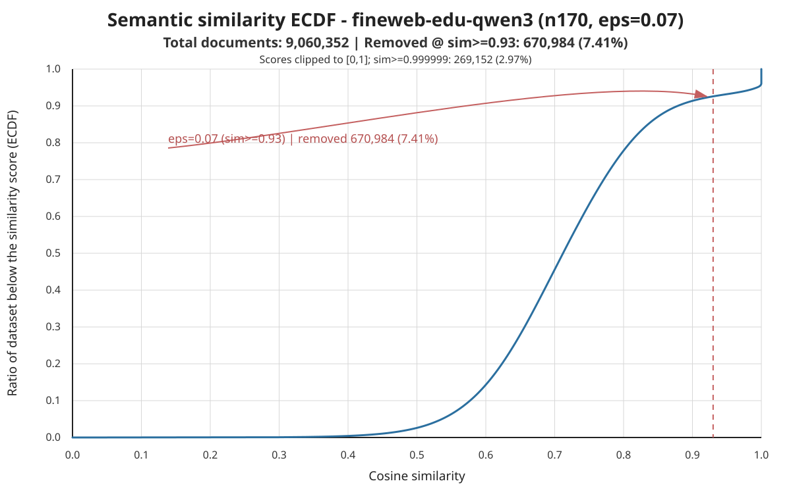

# FineWeb-EDU Qwen3-Embedding-8B SemDeDup Final Report

Generated: 2026-07-13 19:56:21 UTC

## Executive Summary

Qwen3 vs baseline: completed paired seeds 42, 43, 44; final train-val BPB delta -0.000350 +/- 0.000151, final CORE delta 0.003100 +/- 0.007639.

Qwen3 vs previous EmbeddingGemma: Qwen3-minus-EmbeddingGemma final train-val BPB mean 0.000274; Qwen3-minus-EmbeddingGemma final CORE mean 0.000000.

## Conclusion And Insights

The main conclusion is that changing the SemDeDup embedding model from EmbeddingGemma to Qwen3 changes which documents are removed, but does not produce a clear downstream quality win at the fixed `eps=0.07` threshold.

| Signal | Qwen3 | EmbeddingGemma | Qwen3 minus EmbeddingGemma |
|---|---:|---:|---:|
| Final train-val BPB delta vs baseline | -0.000350 +/- 0.000151 | -0.000624 +/- 0.000260 | +0.000274 +/- 0.000386 |
| Final CORE delta vs baseline | +0.003100 +/- 0.007639 | +0.003100 +/- 0.005856 | +0.000000 +/- 0.002464 |
| Removed docs | 670,984 | 633,070 | +37,914 |
| Removed tokens | 735,555,484 | 775,605,001 | -40,049,517 |
| Doc keep ratio | 0.925943 | 0.930127 | -0.004185 |
| Token keep ratio | 0.920993 | 0.916691 | +0.004302 |

- Qwen3 remains better than the no-SemDeDup baseline on BPB and has a small positive mean CORE delta, so the Qwen3 run does not invalidate the earlier FineWeb-EDU SemDeDup result.
- Compared with EmbeddingGemma, Qwen3 is effectively tied on CORE and slightly worse on BPB at this exact threshold; the differences are small relative to seed variance.
- The selection profile is different: Qwen3 removes more documents but fewer tokens than EmbeddingGemma. This suggests Qwen3 is pruning more short duplicate-like documents, while EmbeddingGemma removes fewer but longer documents.
- The best next experiment is an eps/threshold calibration sweep for Qwen3. A fixed `eps=0.07` is not guaranteed to represent the same removal budget across embedding spaces.
- Recommended next step: run a seed-42 Qwen3 sweep around `eps=0.05/0.07/0.09`, include ECDF and data-reduction stats, then promote one calibrated threshold to a 3-seed run. Add a random-drop control matched on removed tokens/docs for the selected threshold before making a stronger quality claim.

## Dataset And Setup

FineWeb-EDU is the educational-quality subset of FineWeb. This experiment uses the NanoChat shuffled 100B-token FineWeb-EDU parquet source and keeps the previous FineWeb-EDU SemDeDup training/eval setup fixed except for the embedding model.

| Item | Value |
|---|---|
| Source dataset | [HuggingFaceFW/fineweb-edu](https://huggingface.co/datasets/HuggingFaceFW/fineweb-edu) |
| NanoChat shard source | [karpathy/fineweb-edu-100b-shuffle](https://huggingface.co/datasets/karpathy/fineweb-edu-100b-shuffle) |
| Paper | [FineWeb paper](https://arxiv.org/abs/2406.17557) |
| Dataset URL used by run | https://huggingface.co/datasets/karpathy/fineweb-edu-100b-shuffle/resolve/main |
| Selected train shards | 170 |
| Original validation shard | shard_01822.parquet |
| Output validation shard | shard_00170.parquet |
| Run root | /home/nfs/hfang/.cache/nanochat_b200_fineweb_edu/experiments/fineweb_edu_qwen3_semdedup_quality |
| Model depth | 24 |
| GPUs | 8 |
| Device batch size | 16 |
| Training horizon | param:data=9.5 |
| Eval every | 250 |
| CORE metric every | 2000 |
| CORE final max per task | -1 |

## Dataset Statistics

| Statistic | Value |
|---|---:|
| FineWeb-EDU source dataset | [HuggingFaceFW/fineweb-edu](https://huggingface.co/datasets/HuggingFaceFW/fineweb-edu) |
| FineWeb-EDU source rows | 1.53B rows on the Hugging Face dataset card |
| NanoChat shuffled subset | [karpathy/fineweb-edu-100b-shuffle](https://huggingface.co/datasets/karpathy/fineweb-edu-100b-shuffle) |
| NanoChat subset rows | 97.2M train rows on the Hugging Face dataset card |
| Selected train shards | 170 |
| Original validation shard | shard_01822.parquet |
| Output validation shard | shard_00170.parquet |
| Train docs before Qwen3 SemDeDup | 9,060,352 |
| Train chars before Qwen3 SemDeDup | 42,888,575,892 |
| Train tokens before Qwen3 SemDeDup | 9,309,977,010 |
| Train docs after Qwen3 SemDeDup | 8,389,368 |
| Train chars after Qwen3 SemDeDup | 39,522,606,608 |
| Train tokens after Qwen3 SemDeDup | 8,574,421,526 |
| Removed docs | 670,984 |
| Removed chars | 3,365,969,284 |
| Removed tokens | 735,555,484 |
| Doc keep ratio | 0.925943 |
| Char keep ratio | 0.921518 |
| Token keep ratio | 0.920993 |

Training tokens consumed per run:

| Seed | Baseline train tokens | Qwen3 train tokens | Qwen3 iterations |
|---:|---:|---:|---:|
| 42 | 6,933,184,512 | 6,933,184,512 | 6,612 |
| 43 | 6,933,184,512 | 6,933,184,512 | 6,612 |
| 44 | 6,933,184,512 | 6,933,184,512 | 6,612 |

Qwen3 SemDeDup runtime breakdown:

| Runtime item | Value |
|---|---:|
| embedding runtime sec | - |
| k-means runtime sec | 703.787614 |
| pairwise runtime sec | 161.588535 |
| removal runtime sec | 160.024297 |
| total dedup runtime sec | 1025.462403 |
| embedding tasks | - |
| k-means tasks | 32 |
| pairwise tasks | 10 |
| resumed from embeddings | true |

## SemDeDup Config

| Config | Value |
|---|---|
| Requested model | qwen3-embedding-8b |
| Resolved model | Qwen/Qwen3-Embedding-8B |
| Embedding preset | qwen3-embedding-8b |
| eps | 0.070000 |
| Similarity threshold | 0.930000 |
| n_clusters | 100 |
| distance metric | cosine |
| which to keep | hard |
| pairwise batch size | 1,024 |
| embedding dim | 4,096 |
| input files per partition | 1 |
| kmeans files per group | 128 |
| vLLM runner | pooling |
| vLLM convert | embed |
| vLLM dtype | bfloat16 |
| vLLM enforce eager | true |
| vLLM attention backend | TRITON_ATTN |
| trust remote code | true |

## Data Reduction

| Data reduction metric | Qwen3 SemDeDup | Previous EmbeddingGemma SemDeDup |
|---|---:|---:|
| input docs | 9,060,352 | 9,060,352 |
| output docs | 8,389,368 | 8,427,282 |
| removed docs | 670,984 | 633,070 |
| input tokens | 9,309,977,010 | 9,309,977,010 |
| output tokens | 8,574,421,526 | 8,534,372,009 |
| removed tokens | 735,555,484 | 775,605,001 |
| doc keep ratio | 0.925943 | 0.930127 |
| token keep ratio | 0.920993 | 0.916691 |
| dedup runtime sec | 1025.462403 | 875.110278 |
| embedding model | Qwen/Qwen3-Embedding-8B | google/embeddinggemma-300m |

## Similarity ECDF

| ECDF statistic | Value |
|---|---:|
| total documents | 9,060,352 |
| eps | 0.070000 |
| similarity threshold | 0.930000 |
| documents below threshold | 8,389,368 |
| removed documents | 670,984 |
| removed ratio | 0.074057 |
| raw min similarity | 0.000000 |
| raw max similarity | 1.000007 |
| raw >1.0 documents | 167,473 |
| raw ==1.0 documents | 9,408 |
| sim >=0.999999 documents | 269,152 |
| sim >=0.999999 ratio | 0.029707 |
| p50 similarity | 0.712074 |
| p90 similarity | 0.878550 |
| p99 similarity | 1.000000 |
| p99.9 similarity | 1.000000 |

## Run-Level Results

| Seed | Baseline run | Qwen3 run | Baseline BPB | Qwen3 BPB | Delta BPB | Baseline CORE | Qwen3 CORE | Delta CORE | Qwen3 runtime sec |
|---:|---|---|---:|---:|---:|---:|---:|---:|---:|
| 42 | full-n170-r9p5-eps0p07-20260622T192524Z_baseline | qwen3-n170-r9p5-eps0p07-safe512-max16k-20260709T185702Z-seed42_semdedup | 0.751186 | 0.750818 | -0.000368 | 0.246800 | 0.243900 | -0.002900 | 5154.600000 |
| 43 | repeat-20260624T000845Z-seed43-n170-r9p5-eps0p07_baseline | qwen3-n170-r9p5-eps0p07-safe512-max16k-20260709T185702Z-seed43_semdedup | 0.751378 | 0.750886 | -0.000492 | 0.238000 | 0.249700 | 0.011700 | 5153.400000 |
| 44 | repeat-20260624T000845Z-seed44-n170-r9p5-eps0p07_baseline | qwen3-n170-r9p5-eps0p07-safe512-max16k-20260709T185702Z-seed44_semdedup | 0.751841 | 0.751650 | -0.000191 | 0.244400 | 0.244900 | 0.000500 | 5161.800000 |

## Aggregate Paired Results

| Metric | Better | Baseline mean +/- sd | Qwen3 SemDeDup mean +/- sd | Paired delta mean +/- sd |
|---|---|---:|---:|---:|
| min val BPB | lower | 0.751468 +/- 0.000337 | 0.751118 +/- 0.000462 | -0.000350 +/- 0.000151 |
| final train val BPB | lower | 0.751468 +/- 0.000337 | 0.751118 +/- 0.000462 | -0.000350 +/- 0.000151 |
| base eval val BPB | lower | 0.750794 +/- 0.000327 | 0.750524 +/- 0.000442 | -0.000270 +/- 0.000137 |
| final CORE | higher | 0.243067 +/- 0.004549 | 0.246167 +/- 0.003101 | 0.003100 +/- 0.007639 |
| train runtime sec | lower | 5822.800000 +/- 440.407493 | 5156.600000 +/- 4.543127 | -666.200000 +/- 444.713076 |
| train iterations | lower | 6612.000000 +/- 0.000000 | 6612.000000 +/- 0.000000 | 0.000000 +/- 0.000000 |
| train tokens | lower | 6933184512.000000 +/- 0.000000 | 6933184512.000000 +/- 0.000000 | 0.000000 +/- 0.000000 |
| steps to paired baseline BPB | lower | 6612.000000 +/- 0.000000 | 6612.000000 +/- 0.000000 | 0.000000 +/- 0.000000 |
| runtime sec to paired baseline BPB | lower | 5822.800000 +/- 440.407493 | 5156.600000 +/- 4.543127 | -666.200000 +/- 444.713076 |

## Per-Task CORE Deltas

| CORE task | N | Delta mean | Delta sd | Min delta | Max delta |
|---|---:|---:|---:|---:|---:|
| commonsense_qa | 3 | -0.038220 | 0.047605 | -0.085995 | 0.009214 |
| copa | 3 | -0.033333 | 0.030551 | -0.060000 | 0.000000 |
| jeopardy | 3 | -0.021729 | 0.017819 | -0.041568 | -0.007085 |
| bigbench_cs_algorithms | 3 | -0.014394 | 0.035959 | -0.045454 | 0.025000 |
| arc_easy | 3 | -0.007296 | 0.005353 | -0.010663 | -0.001123 |
| bigbench_qa_wikidata | 3 | -0.006545 | 0.005415 | -0.009843 | -0.000295 |
| openbook_qa | 3 | -0.005333 | 0.007055 | -0.013333 | 0.000000 |
| arc_challenge | 3 | -0.000380 | 0.007575 | -0.006826 | 0.007963 |
| hellaswag | 3 | 0.001505 | 0.004356 | -0.001460 | 0.006506 |
| agi_eval_lsat_ar | 3 | 0.001811 | 0.031845 | -0.021739 | 0.038043 |
| hellaswag_zeroshot | 3 | 0.001814 | 0.002542 | -0.000532 | 0.004514 |
| bigbench_language_identification | 3 | 0.002420 | 0.007719 | -0.002200 | 0.011331 |
| coqa | 3 | 0.002798 | 0.009524 | -0.006012 | 0.012903 |
| winogrande | 3 | 0.005262 | 0.032517 | -0.031571 | 0.029992 |
| lambada_openai | 3 | 0.007827 | 0.017258 | -0.004464 | 0.027557 |
| bigbench_repeat_copy_logic | 3 | 0.010417 | 0.018042 | 0.000000 | 0.031250 |
| bigbench_dyck_languages | 3 | 0.012667 | 0.011504 | 0.001000 | 0.024000 |
| bigbench_operators | 3 | 0.014286 | 0.016496 | -0.004762 | 0.023810 |
| squad | 3 | 0.018386 | 0.005201 | 0.013624 | 0.023936 |
| piqa | 3 | 0.024664 | 0.008311 | 0.017410 | 0.033732 |
| winograd | 3 | 0.043956 | 0.014652 | 0.029304 | 0.058608 |
| boolq | 3 | 0.048017 | 0.133762 | -0.098987 | 0.162562 |

## Comparison To Previous EmbeddingGemma SemDeDup

| Metric | Better | Qwen3 delta vs baseline | EmbeddingGemma delta vs baseline | Qwen3 value minus EmbeddingGemma value |
|---|---|---:|---:|---:|
| min val BPB | lower | -0.000350 +/- 0.000151 | -0.000624 +/- 0.000260 | 0.000274 +/- 0.000386 |
| final train val BPB | lower | -0.000350 +/- 0.000151 | -0.000624 +/- 0.000260 | 0.000274 +/- 0.000386 |
| base eval val BPB | lower | -0.000270 +/- 0.000137 | -0.000498 +/- 0.000251 | 0.000228 +/- 0.000369 |
| final CORE | higher | 0.003100 +/- 0.007639 | 0.003100 +/- 0.005856 | 0.000000 +/- 0.002464 |

This section is intentionally separate from the baseline comparison above. The first comparison asks whether Qwen3 SemDeDup beats no SemDeDup under paired seeds; this section asks whether changing only the SemDeDup embedding model moves the SemDeDup result relative to the prior EmbeddingGemma run.

## Reproducibility And Compatibility Notes

| Check | Result |
|---|---|
| Run root | /home/nfs/hfang/.cache/nanochat_b200_fineweb_edu/experiments/fineweb_edu_qwen3_semdedup_quality/qwen3-n170-r9p5-eps0p07-safe512-max16k-20260709T185702Z-seed42_semdedup |
| Resumed from cached embeddings | true |
| Embedding dim used by Curator | 4,096 |
| K-means parquet group cap | 128 |
| EmbeddingGemma default dry-run compatibility | passed: google/embeddinggemma-300m resolves with embedding_dim=768 and empty vLLM kwargs |
| EmbeddingGemma workflow constructor compatibility | passed: TextSemanticDeduplicationWorkflow accepts embedding_dim=768 |

The Qwen3 seed-42 build reused the already completed embedding cache and reran semantic deduplication from k-means onward. The compatibility checks were run after the fix to verify the prior EmbeddingGemma path still resolves through the default model identifier and constructs a Curator workflow without Qwen-specific vLLM kwargs.

## Artifact Status

All requested run artifacts are present.

## Limitations

- Only the embedding model is changed; eps, n_clusters, train shards, validation shard, model depth, training horizon, and eval settings are kept aligned with the previous FineWeb-EDU report.
- The Qwen3 deduped dataset is built once with seed 42 and reused for seeds 43 and 44, so the three Qwen3 training seeds test training variance rather than three independently deduped datasets.
- Random-drop controls are not rerun in this plan.
- Small BPB or CORE differences should be read with the paired seed variance and per-task table, not as a single-seed result.

## Artifact Inventory

| Artifact | Path |
|---|---|
| Qwen3 final report | /home/nfs/hfang/curator_eval/nanochat/reports/semdedup_quality/fineweb_edu/qwen3_final_report.md |
| Qwen3 summary JSON | /home/nfs/hfang/curator_eval/nanochat/reports/semdedup_quality/fineweb_edu/qwen3_final_report_summary.json |
| Qwen3 ECDF SVG | /home/nfs/hfang/curator_eval/nanochat/reports/semdedup_quality/fineweb_edu/qwen3_semdedup_similarity_ecdf.svg |
| Qwen3 ECDF stats JSON | /home/nfs/hfang/curator_eval/nanochat/reports/semdedup_quality/fineweb_edu/qwen3_semdedup_similarity_ecdf.json |
| Qwen3 curator dry-run config | /home/nfs/hfang/.cache/nanochat_b200_fineweb_edu/experiments/fineweb_edu_qwen3_semdedup_quality/qwen3_curator_dry_run_config.json |
