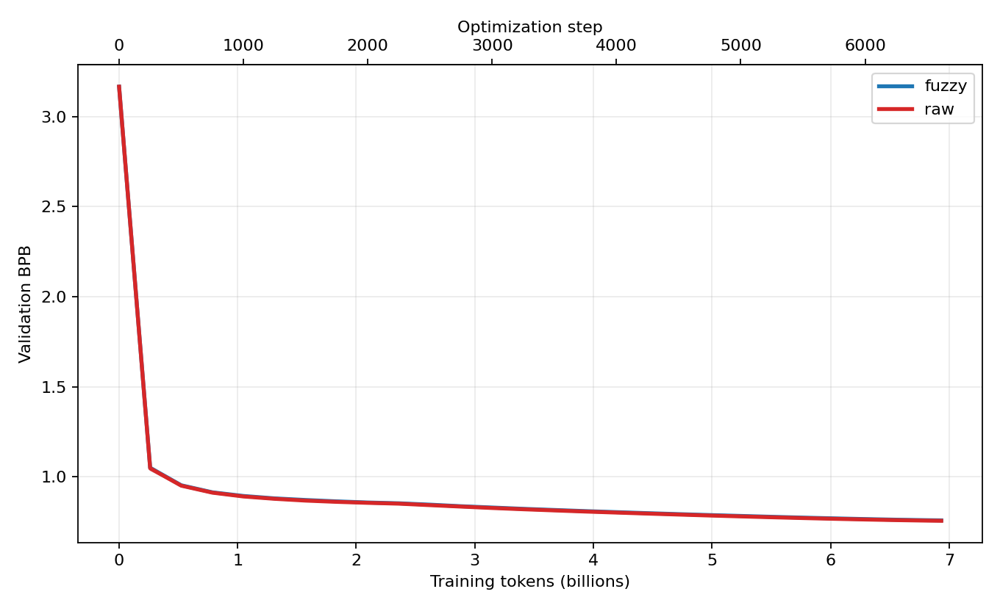
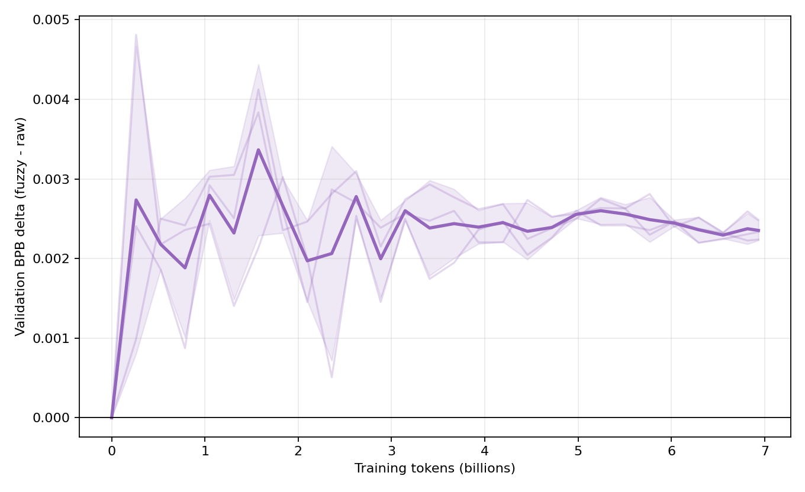
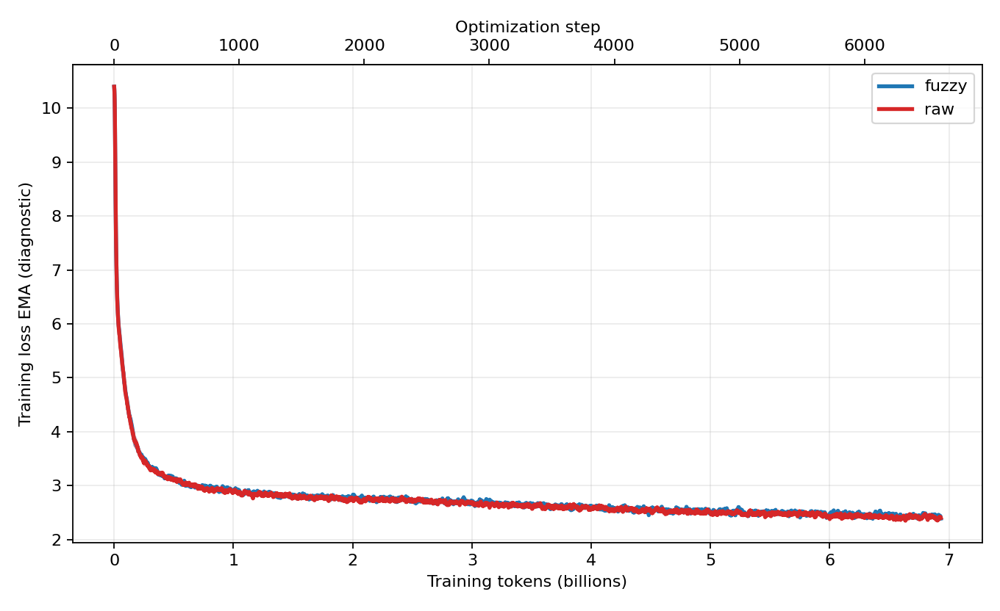
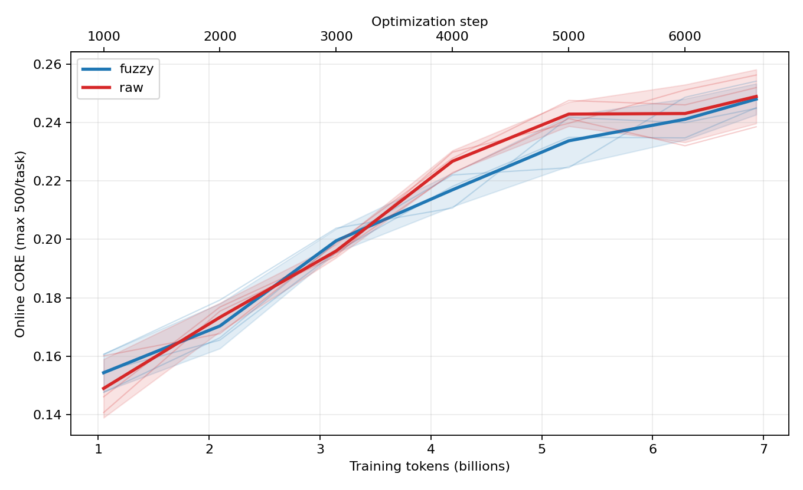
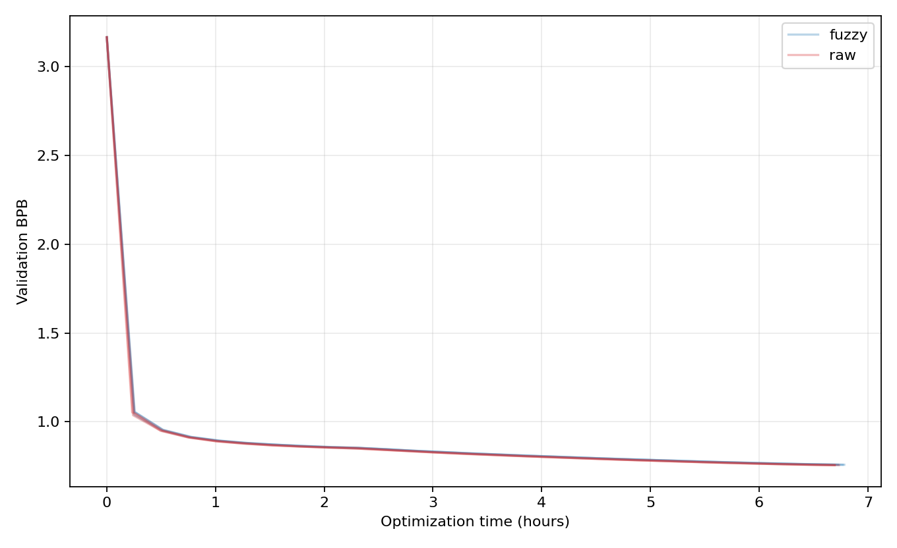
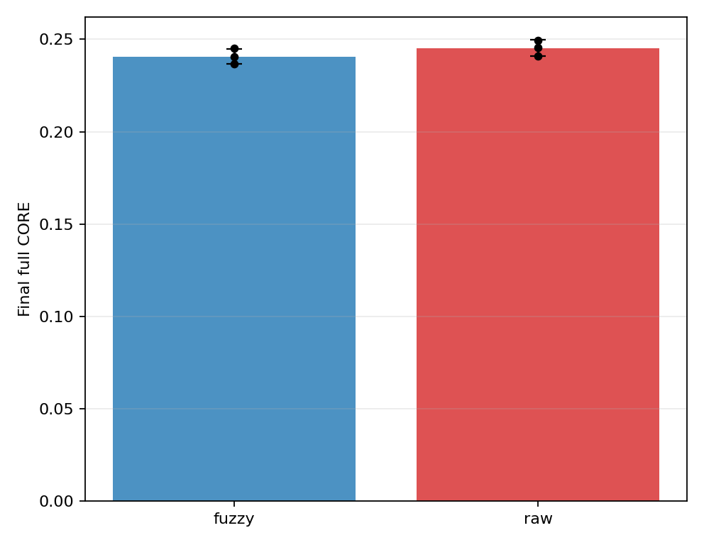
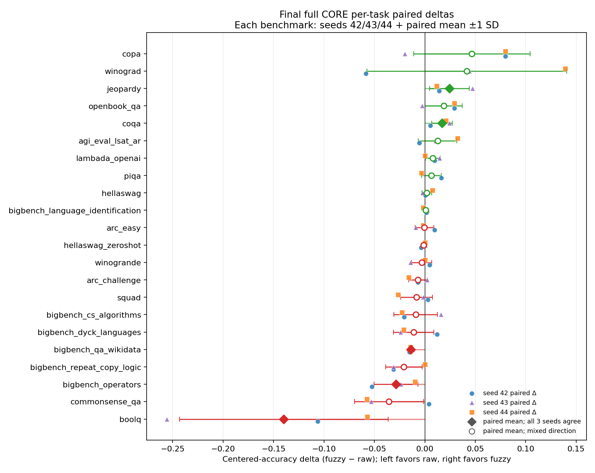
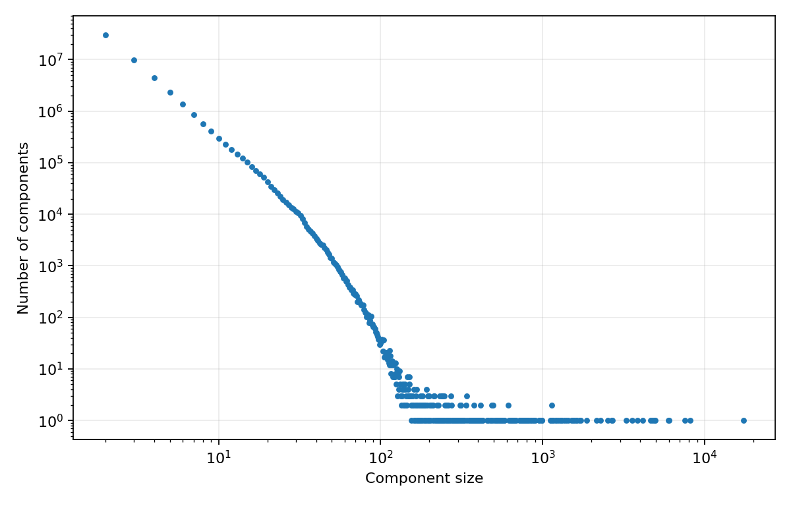
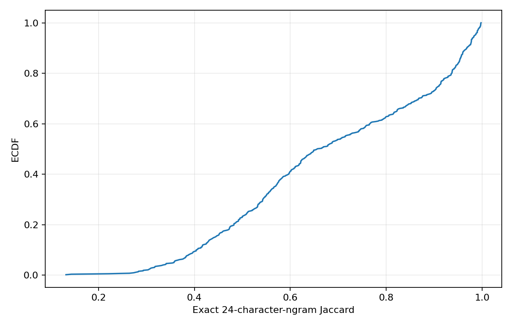

# FineWeb-EDU-Fortified fuzzy dedup × NanoChat d24

Generated: 2026-07-27T20:10:59.490522+00:00

## Executive summary

Completed paired seeds: **3**.
Mean paired final BPB delta (fuzzy - raw): **0.002353 ± 0.000125**; lower is better.
Mean paired final CORE delta: **-0.0046 ± 0.0085**; higher is better.
Fuzzy reached the paired raw target earlier in **0/3** seeds.
Mean raw target-token exposure to fuzzy-removed documents: **0.4145 ± 0.0000**.

## Run results

| Seed | Fuzzy BPB | Raw BPB | Δ BPB | Fuzzy CORE | Raw CORE | Δ CORE | Raw removed-target fraction |
|---|---|---|---|---|---|---|---|
| 42 | 0.758105 | 0.755866 | 0.002239 | 0.2404 | 0.2454 | -0.0050 | 0.4145 |
| 43 | 0.758385 | 0.756050 | 0.002335 | 0.2368 | 0.2496 | -0.0128 | 0.4145 |
| 44 | 0.758378 | 0.755892 | 0.002486 | 0.2451 | 0.2410 | 0.0041 | 0.4145 |

## Quantitative Analysis

[Open the interactive validation dashboard](interactive_validation_analysis.html) — download and open locally for zoom, hover, seed/mean toggles, and paired deltas versus tokens or wall time.

## LM Eval Harness Results

Each benchmark row contains exactly three individual points: the paired centered-accuracy deltas for seeds 42, 43, and 44 (`fuzzy - raw` within the same seed). The colored diamond/circle is their paired mean and the horizontal error bar is ±1 sample SD. A filled diamond means all three seeds agree in direction; an open circle means mixed directions. No significance p-value is reported for n=3.

## Dataset Analysis

| Arm | Selected docs | Selected source tokens | Excluded val-overlap docs | Removed token fraction |
|---|---|---|---|---|
| fuzzy | 16,364,080 | 16,516,227,376 | 2905 | 0.0000 |
| raw | 25,778,103 | 29,769,525,778 | 4240 | 0.4452 |

Full corpus raw/fuzzy documents: **322,250,000 / 204,557,770**.
Full corpus raw/fuzzy NanoChat tokens: **372,119,004,120 / 206,617,563,878**.

### Retention by Common Crawl snapshot

| Subset | Raw sampled docs | Fuzzy sampled docs | Token keep ratio |
|---|---|---|---|
| CC-MAIN-2013-20 | 863150 | 629305 | 0.6764 |
| CC-MAIN-2013-48 | 463783 | 271913 | 0.5136 |
| CC-MAIN-2014-10 | 283889 | 146862 | 0.4344 |
| CC-MAIN-2014-15 | 147769 | 61643 | 0.3391 |
| CC-MAIN-2014-23 | 248138 | 116311 | 0.3826 |
| CC-MAIN-2014-35 | 120505 | 43757 | 0.2729 |
| CC-MAIN-2014-41 | 127946 | 51870 | 0.3169 |
| CC-MAIN-2014-42 | 91946 | 34353 | 0.2882 |
| CC-MAIN-2014-49 | 83978 | 29129 | 0.2708 |
| CC-MAIN-2014-52 | 108210 | 38093 | 0.2721 |
| CC-MAIN-2015-06 | 96107 | 32847 | 0.2685 |
| CC-MAIN-2015-11 | 95942 | 33007 | 0.2667 |
| CC-MAIN-2015-14 | 80185 | 25703 | 0.2392 |
| CC-MAIN-2015-18 | 103898 | 37546 | 0.2826 |
| CC-MAIN-2015-22 | 87806 | 28735 | 0.2692 |
| CC-MAIN-2015-27 | 83220 | 27533 | 0.2597 |
| CC-MAIN-2015-32 | 76535 | 28135 | 0.2758 |
| CC-MAIN-2015-35 | 79868 | 26848 | 0.2429 |
| CC-MAIN-2015-40 | 68011 | 21027 | 0.2127 |
| CC-MAIN-2015-48 | 95870 | 31856 | 0.2509 |
| CC-MAIN-2016-07 | 104107 | 34192 | 0.2594 |
| CC-MAIN-2016-18 | 84174 | 27863 | 0.2703 |
| CC-MAIN-2016-22 | 84216 | 34295 | 0.3566 |
| CC-MAIN-2016-26 | 52062 | 17348 | 0.2660 |
| CC-MAIN-2016-30 | 100990 | 34397 | 0.2482 |
| CC-MAIN-2016-36 | 79771 | 27669 | 0.2560 |
| CC-MAIN-2016-40 | 187892 | 105302 | 0.4438 |
| CC-MAIN-2016-44 | 384491 | 251512 | 0.5764 |
| CC-MAIN-2016-50 | 243121 | 130662 | 0.4535 |
| CC-MAIN-2017-04 | 244174 | 133052 | 0.4683 |
| CC-MAIN-2017-09 | 275525 | 168538 | 0.5281 |
| CC-MAIN-2017-13 | 508265 | 356097 | 0.6360 |
| CC-MAIN-2017-17 | 335242 | 217414 | 0.5736 |
| CC-MAIN-2017-22 | 259945 | 159581 | 0.5223 |
| CC-MAIN-2017-26 | 332049 | 233575 | 0.5971 |
| CC-MAIN-2017-30 | 244507 | 160813 | 0.5620 |
| CC-MAIN-2017-34 | 276485 | 186882 | 0.5650 |
| CC-MAIN-2017-39 | 260433 | 169476 | 0.5499 |
| CC-MAIN-2017-43 | 260228 | 167868 | 0.5624 |
| CC-MAIN-2017-47 | 236110 | 150732 | 0.5435 |
| CC-MAIN-2017-51 | 203181 | 131093 | 0.5396 |
| CC-MAIN-2018-05 | 275898 | 182509 | 0.5756 |
| CC-MAIN-2018-09 | 287703 | 186057 | 0.5410 |
| CC-MAIN-2018-13 | 231515 | 145061 | 0.5229 |
| CC-MAIN-2018-17 | 207682 | 126271 | 0.5131 |
| CC-MAIN-2018-22 | 208093 | 133977 | 0.5525 |
| CC-MAIN-2018-26 | 247552 | 173177 | 0.6059 |
| CC-MAIN-2018-30 | 200226 | 123002 | 0.5064 |
| CC-MAIN-2018-34 | 176330 | 101761 | 0.4567 |
| CC-MAIN-2018-39 | 175535 | 95106 | 0.4284 |
| CC-MAIN-2018-43 | 304415 | 227454 | 0.6560 |
| CC-MAIN-2018-47 | 252838 | 175898 | 0.5900 |
| CC-MAIN-2018-51 | 263986 | 174479 | 0.5514 |
| CC-MAIN-2019-04 | 244056 | 158258 | 0.5447 |
| CC-MAIN-2019-09 | 227672 | 143736 | 0.5270 |
| CC-MAIN-2019-13 | 199621 | 119084 | 0.4970 |
| CC-MAIN-2019-18 | 212108 | 131910 | 0.5254 |
| CC-MAIN-2019-22 | 248170 | 159703 | 0.5378 |
| CC-MAIN-2019-26 | 220044 | 136349 | 0.5087 |
| CC-MAIN-2019-30 | 219121 | 134765 | 0.5072 |
| CC-MAIN-2019-35 | 263759 | 169211 | 0.5405 |
| CC-MAIN-2019-39 | 235438 | 151463 | 0.5384 |
| CC-MAIN-2019-43 | 252002 | 158334 | 0.5356 |
| CC-MAIN-2019-47 | 251924 | 163883 | 0.5525 |
| CC-MAIN-2019-51 | 207463 | 131483 | 0.5341 |
| CC-MAIN-2020-05 | 236317 | 142462 | 0.5041 |
| CC-MAIN-2020-10 | 240009 | 153092 | 0.5457 |
| CC-MAIN-2020-16 | 264164 | 168027 | 0.5585 |
| CC-MAIN-2020-24 | 284155 | 181215 | 0.5573 |
| CC-MAIN-2020-29 | 311723 | 193576 | 0.5377 |
| CC-MAIN-2020-34 | 263905 | 169445 | 0.5412 |
| CC-MAIN-2020-40 | 372691 | 253564 | 0.5956 |
| CC-MAIN-2020-45 | 332284 | 227788 | 0.5943 |
| CC-MAIN-2020-50 | 291600 | 193332 | 0.5768 |
| CC-MAIN-2021-04 | 356301 | 230129 | 0.5760 |
| CC-MAIN-2021-10 | 336131 | 233621 | 0.6325 |
| CC-MAIN-2021-17 | 355705 | 244493 | 0.6350 |
| CC-MAIN-2021-21 | 289106 | 190565 | 0.5896 |
| CC-MAIN-2021-25 | 314941 | 215773 | 0.6105 |
| CC-MAIN-2021-31 | 312058 | 200012 | 0.5664 |
| CC-MAIN-2021-39 | 364190 | 246282 | 0.5974 |
| CC-MAIN-2021-43 | 375611 | 258530 | 0.6216 |
| CC-MAIN-2021-49 | 348086 | 245731 | 0.6352 |
| CC-MAIN-2022-05 | 355829 | 242857 | 0.6140 |
| CC-MAIN-2022-21 | 524730 | 358985 | 0.6236 |
| CC-MAIN-2022-27 | 443691 | 300917 | 0.6156 |
| CC-MAIN-2022-33 | 380151 | 264831 | 0.6337 |
| CC-MAIN-2022-40 | 427360 | 299732 | 0.6432 |
| CC-MAIN-2022-49 | 436762 | 293493 | 0.6082 |
| CC-MAIN-2023-06 | 420397 | 284319 | 0.6167 |
| CC-MAIN-2023-14 | 804112 | 510967 | 0.5900 |
| CC-MAIN-2023-23 | 796894 | 497531 | 0.5812 |
| CC-MAIN-2023-40 | 647200 | 485302 | 0.7029 |
| CC-MAIN-2023-50 | 655193 | 509905 | 0.7397 |
| CC-MAIN-2024-10 | 459932 | 349839 | 0.7371 |

### Retention by document length

| Token bin | Raw sampled docs | Fuzzy sampled docs | Token keep ratio |
|---|---|---|---|
| lt128 | 567561 | 460692 | 0.8081 |
| 128_511 | 9230198 | 6404816 | 0.6845 |
| 512_2047 | 13196648 | 8063663 | 0.6039 |
| ge2048 | 2783696 | 1434909 | 0.4789 |

### Removed → keeper examples

| Jaccard | Component size | Removed preview | Keeper preview |
|---|---|---|---|
| 0.379 | 110 | A magnetic field is the magnetic influence of electric currents and magnetic materials. The magnetic field at any given point is specified by both a direction and a magnitude (or s | A magnetic field is a vector field that describes the magnetic influence on moving electric charges, electric currents, ch1 and magnetic materials. A moving charge in a magnetic fi |
| 0.442 | 110 | \|Part of a series of articles about\| A magnetic field is a vector field that describes the magnetic influence of electric charges in relative motion and magnetized materials. The | A magnetic field is a vector field that describes the magnetic influence on moving electric charges, electric currents, ch1 and magnetic materials. A moving charge in a magnetic fi |
| 0.417 | 110 | Magnetic field(Redirected from Magnetic fields) A magnetic field is a vector field that describes the magnetic influence of electrical currents and magnetized materials. In everyda | A magnetic field is a vector field that describes the magnetic influence on moving electric charges, electric currents, ch1 and magnetic materials. A moving charge in a magnetic fi |
| 0.482 | 110 | A magnetic field is a vector field that describes the magnetic influence on an electric charge of other moving charges or magnetized materials. A charge that is moving in a magneti | A magnetic field is a vector field that describes the magnetic influence on moving electric charges, electric currents, ch1 and magnetic materials. A moving charge in a magnetic fi |
| 0.396 | 110 | Magnetic field(Redirected from Magnetic fields) A magnetic field is a force field that is created by moving electric charges (electric currents) and magnetic dipoles, and exerts a  | A magnetic field is a vector field that describes the magnetic influence on moving electric charges, electric currents, ch1 and magnetic materials. A moving charge in a magnetic fi |

## Reproducibility

Validation checksum: `a97e7f2f4680561c1fdf0461295b0cfc38d85f497ba03851ab267ac1b8165990`.
Fuzzy view manifest checksum: `35e1a2eb6d7833b82d5c55c9403ca0a35c7b8a29505ede7e303a2277079015ab`.
Raw view manifest checksum: `84728c719ee2b8eba590cd3653e346472bcc9bb5316c47b382b1c836161ff9cb`.

## Interpretation

- Token efficiency is evaluated against each paired raw run's final BPB using a cumulative-min validation curve.
- Final BPB and CORE deltas are paired by model seed; all individual seeds are retained because n=3 is too small for a meaningful significance test.
- Training loss is diagnostic only because the two arms see different document distributions.
- Online CORE uses at most 500 examples per task; final CORE is the full evaluation.
