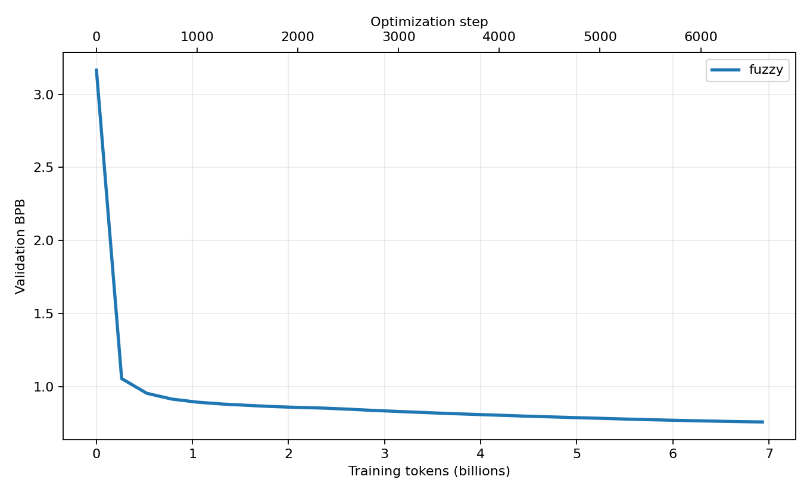
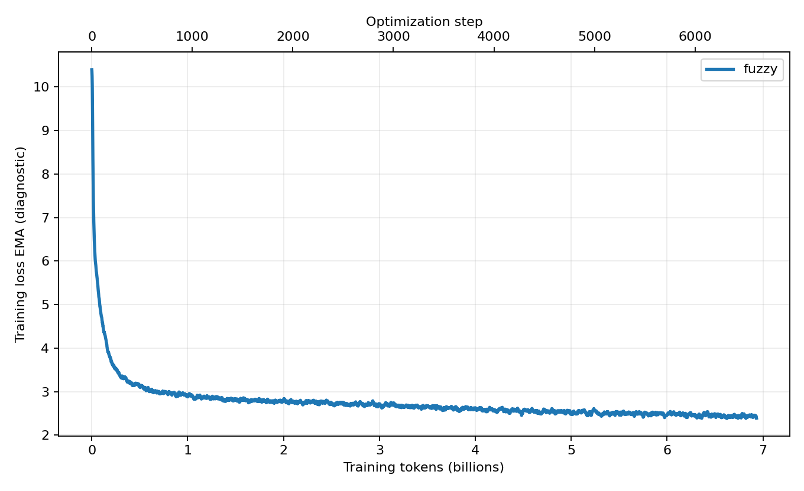
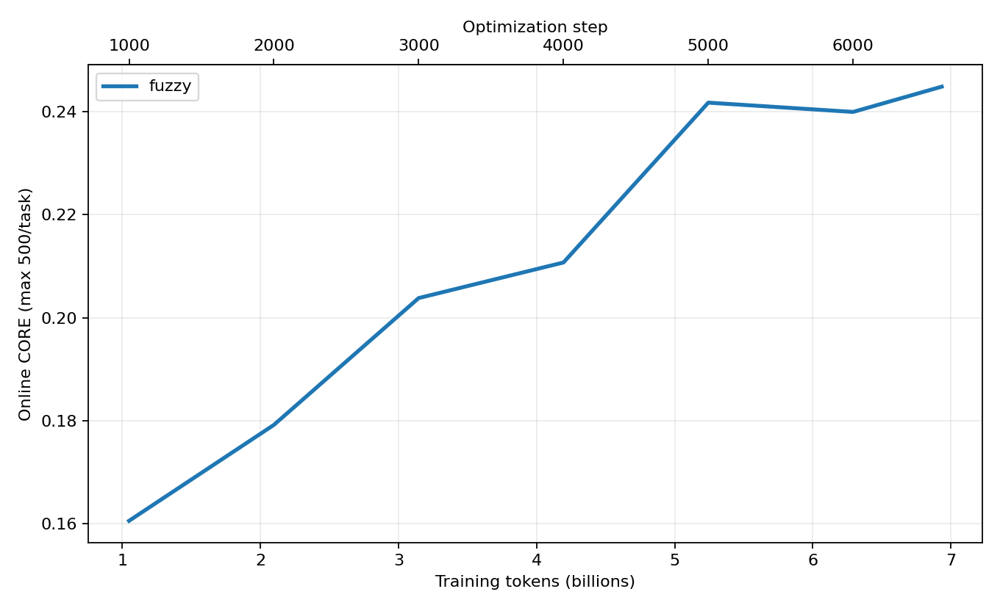
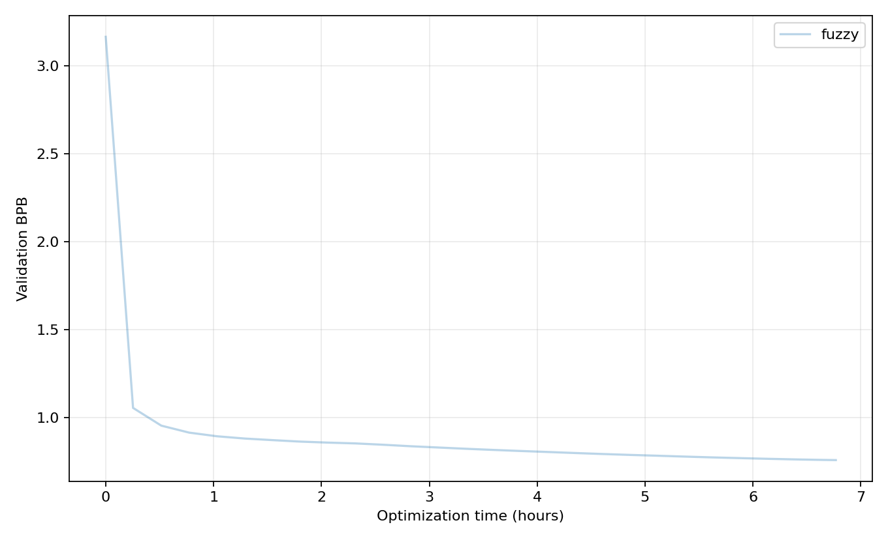
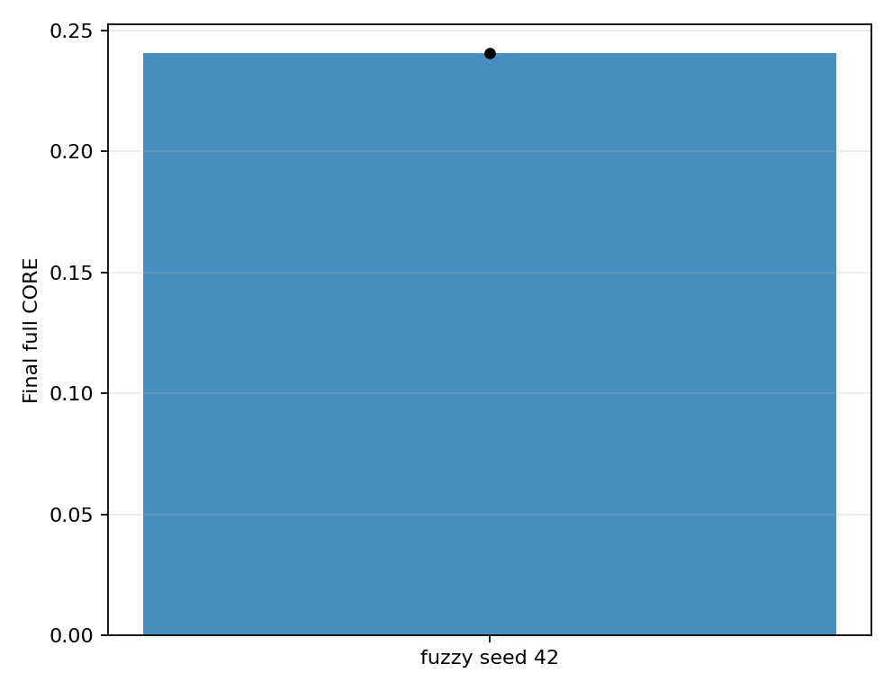
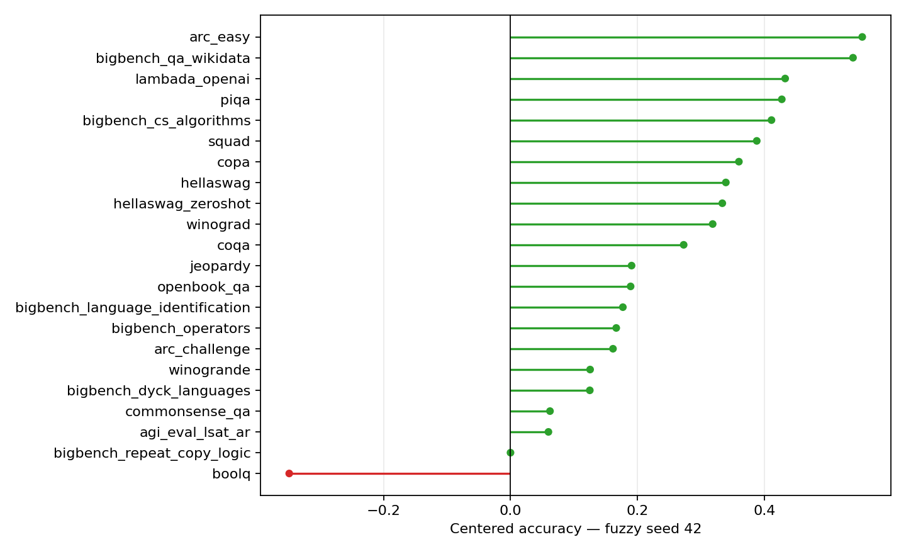

# FineWeb-EDU-Fortified fuzzy dedup × NanoChat d24 — Pioneer report

Generated: 2026-07-23T19:02:09.896007+00:00

> This is a fuzzy-only, single-seed pioneer report. It validates the completed training and evaluation pipeline, but does not estimate the causal effect of fuzzy deduplication. The paired raw comparison will appear in the final report.

## Executive summary

Completed arm/seed: **fuzzy / 42**.
Optimization steps and training tokens: **6,612 / 6,933,184,512**.
Final in-training validation BPB: **0.758105**; minimum observed BPB: **0.758105**.
Independent final validation BPB: **0.758163**.
Final full CORE: **0.2404**.
Optimization wall time: **6.77 hours**.

## Experimental setup

### Experiment question and pioneer scope

The full experiment is a controlled, paired comparison between the existing FineWeb-EDU-Fortified fuzzy-deduplicated corpus and the corresponding raw corpus. This pioneer run covers only the fuzzy arm with model seed **42**. It is intended to validate the data, training, evaluation, and reporting pipeline before the paired raw results are available; by itself it cannot measure the effect of deduplication.

### Training data and deterministic ordering

- The fuzzy-deduplicated dataset already existed; fuzzy deduplication was not rerun for this experiment.
- The training view is the stable-hash interval `[0, 0.08)`, selected with `xxh3_128(seed=20260722, subset + "\0" + doc_id)` and emitted as 512 ordered buckets. This makes document selection and ordering independent of source-file enumeration and worker count.
- The selected view contains **16,364,080 documents** and **16,516,227,376 source tokens**, enough to complete the fixed training budget without an epoch rollover.
- Exact matches to the shared validation set were excluded: **2,905 documents / 2,761,872 source tokens**.
- Validation uses the fixed held-out FineWeb-EDU parquet shard recorded in the reproducibility section. The same validation data will be used for every fuzzy/raw seed.

### What “NanoChat d24” means

`d24` means a NanoChat Transformer with **24 layers**; it does not mean a 24-billion-parameter model. With NanoChat's default depth-to-width rule (`n_embd = depth × 64`), this run has width 1,536.

| Model field | Value |
|---|---|
| Transformer layers | 24 |
| Model width | 1,536 |
| Attention heads / KV heads | 12 / 12 |
| Head dimension | 128 |
| Context length | 2,048 tokens |
| Attention window pattern | `L` (full attention in every layer) |
| Vocabulary size | 32,768 |
| Total parameters | 1,384,122,122 |
| Scaling parameters | 729,810,624 |

NanoChat reports the training-token ratio against its scaling-parameter count (Transformer matrices plus the language-model head), rather than against all stored parameters. Therefore `6,933,184,512 / 729,810,624 = 9.50` tokens per scaling parameter.

### Optimization and distributed execution

| Training field | Value |
|---|---|
| Hardware | 8 × NVIDIA B200 |
| Model seed | 42 |
| Optimization steps | 6,612 |
| Global target-token batch | 1,048,576 tokens |
| Per-rank micro-batch | 16 sequences × 2,048 tokens |
| Gradient accumulation | 4 micro-steps |
| Total training tokens | 6,933,184,512 |
| Numerics | BF16 compute; tensorwise FP8 linear training |
| Optimizer | Muon for matrix parameters; AdamW for other parameters |
| LR schedule | 40-step warmup, then linear warmdown over the final 65% to 5% of peak LR |
| Checkpointing | Final checkpoint only; resumable model, optimizer, and data cursor state |

The global batch and training budget follow directly from:

`16 sequences/rank × 2,048 tokens × 8 ranks × 4 accumulation steps = 1,048,576 tokens/step`

`1,048,576 tokens/step × 6,612 steps = 6,933,184,512 training tokens`

FP8 was enabled for 145 of 158 linear layers; evaluation temporarily used non-FP8 linear layers. Flash Attention 3 was unavailable on this run, so attention used the PyTorch SDPA fallback.

### Evaluation and experiment records

- Validation BPB was measured at step 0, every 250 optimization steps, and at the final step, using 41,943,040 validation tokens per measurement.
- Online CORE was measured every 1,000 steps with at most 500 examples per task and evaluation seed 1,337. The final CORE evaluation used the full available task sets (`max_per_task = -1`).
- W&B ran in offline mode. The run also saved local logs, structured JSON/CSV results, checksums, plots, and the final model checkpoint.
- The full study repeats this configuration for fuzzy seeds 42/43/44 and paired raw seeds 42/43/44. Only those paired results support conclusions about fuzzy deduplication.

## Run results

| Arm | Seed | Steps | Training tokens | Final BPB | Eval BPB | Final CORE |
|---|---|---|---|---|---|---|
| fuzzy | 42 | 6,612 | 6,933,184,512 | 0.758105 | 0.758163 | 0.2404 |

## Quantitative Analysis

## LM Eval Harness Results

## Dataset Analysis

| Selected docs | Selected source tokens | Excluded validation-overlap docs | Excluded validation-overlap tokens |
|---|---|---|---|
| 16,364,080 | 16,516,227,376 | 2,905 | 2,761,872 |

Full post-fuzzy corpus: **204,557,770 documents / 206,617,563,878 NanoChat tokens**.

### Selected fuzzy data by Common Crawl snapshot

| Subset | Documents | Source tokens |
|---|---|---|
| CC-MAIN-2013-20 | 629,305 | 608,041,358 |
| CC-MAIN-2013-48 | 271,913 | 254,795,292 |
| CC-MAIN-2014-10 | 146,862 | 141,836,000 |
| CC-MAIN-2014-15 | 61,643 | 61,130,930 |
| CC-MAIN-2014-23 | 116,311 | 109,099,006 |
| CC-MAIN-2014-35 | 43,757 | 40,058,201 |
| CC-MAIN-2014-41 | 51,870 | 47,707,295 |
| CC-MAIN-2014-42 | 34,353 | 32,467,587 |
| CC-MAIN-2014-49 | 29,129 | 28,221,437 |
| CC-MAIN-2014-52 | 38,093 | 37,001,520 |
| CC-MAIN-2015-06 | 32,847 | 32,846,293 |
| CC-MAIN-2015-11 | 33,007 | 33,855,599 |
| CC-MAIN-2015-14 | 25,703 | 25,565,541 |
| CC-MAIN-2015-18 | 37,546 | 38,281,810 |
| CC-MAIN-2015-22 | 28,735 | 32,509,548 |
| CC-MAIN-2015-27 | 27,533 | 29,206,688 |
| CC-MAIN-2015-32 | 28,135 | 27,989,292 |
| CC-MAIN-2015-35 | 26,848 | 26,290,293 |
| CC-MAIN-2015-40 | 21,027 | 20,297,586 |
| CC-MAIN-2015-48 | 31,856 | 33,013,686 |
| CC-MAIN-2016-07 | 34,192 | 39,317,309 |
| CC-MAIN-2016-18 | 27,863 | 26,285,669 |
| CC-MAIN-2016-22 | 34,295 | 35,162,052 |
| CC-MAIN-2016-26 | 17,348 | 16,313,587 |
| CC-MAIN-2016-30 | 34,397 | 37,990,927 |
| CC-MAIN-2016-36 | 27,669 | 31,076,541 |
| CC-MAIN-2016-40 | 105,302 | 86,060,986 |
| CC-MAIN-2016-44 | 251,512 | 206,924,870 |
| CC-MAIN-2016-50 | 130,662 | 117,078,974 |
| CC-MAIN-2017-04 | 133,052 | 127,989,789 |
| CC-MAIN-2017-09 | 168,538 | 166,950,524 |
| CC-MAIN-2017-13 | 356,097 | 343,230,021 |
| CC-MAIN-2017-17 | 217,414 | 202,119,561 |
| CC-MAIN-2017-22 | 159,581 | 142,174,787 |
| CC-MAIN-2017-26 | 233,575 | 200,710,385 |
| CC-MAIN-2017-30 | 160,813 | 135,885,646 |
| CC-MAIN-2017-34 | 186,882 | 152,838,990 |
| CC-MAIN-2017-39 | 169,476 | 152,602,196 |
| CC-MAIN-2017-43 | 167,868 | 159,721,358 |
| CC-MAIN-2017-47 | 150,732 | 142,066,567 |
| CC-MAIN-2017-51 | 131,093 | 118,896,246 |
| CC-MAIN-2018-05 | 182,509 | 164,911,929 |
| CC-MAIN-2018-09 | 186,057 | 157,610,644 |
| CC-MAIN-2018-13 | 145,061 | 124,722,487 |
| CC-MAIN-2018-17 | 126,271 | 110,220,194 |
| CC-MAIN-2018-22 | 133,977 | 121,616,454 |
| CC-MAIN-2018-26 | 173,177 | 164,401,682 |
| CC-MAIN-2018-30 | 123,002 | 119,970,032 |
| CC-MAIN-2018-34 | 101,761 | 95,164,558 |
| CC-MAIN-2018-39 | 95,106 | 92,986,413 |
| CC-MAIN-2018-43 | 227,454 | 212,082,411 |
| CC-MAIN-2018-47 | 175,898 | 175,581,606 |
| CC-MAIN-2018-51 | 174,479 | 159,570,382 |
| CC-MAIN-2019-04 | 158,258 | 146,750,115 |
| CC-MAIN-2019-09 | 143,736 | 140,968,846 |
| CC-MAIN-2019-13 | 119,084 | 119,331,131 |
| CC-MAIN-2019-18 | 131,910 | 137,850,801 |
| CC-MAIN-2019-22 | 159,703 | 156,593,074 |
| CC-MAIN-2019-26 | 136,349 | 133,534,307 |
| CC-MAIN-2019-30 | 134,765 | 133,857,027 |
| CC-MAIN-2019-35 | 169,211 | 167,475,019 |
| CC-MAIN-2019-39 | 151,463 | 148,589,005 |
| CC-MAIN-2019-43 | 158,334 | 165,459,195 |
| CC-MAIN-2019-47 | 163,883 | 163,882,166 |
| CC-MAIN-2019-51 | 131,483 | 133,048,135 |
| CC-MAIN-2020-05 | 142,462 | 141,526,773 |
| CC-MAIN-2020-10 | 153,092 | 151,760,805 |
| CC-MAIN-2020-16 | 168,027 | 166,799,249 |
| CC-MAIN-2020-24 | 181,215 | 178,691,943 |
| CC-MAIN-2020-29 | 193,576 | 194,336,006 |
| CC-MAIN-2020-34 | 169,445 | 168,732,063 |
| CC-MAIN-2020-40 | 253,564 | 241,765,833 |
| CC-MAIN-2020-45 | 227,788 | 219,568,220 |
| CC-MAIN-2020-50 | 193,332 | 191,024,086 |
| CC-MAIN-2021-04 | 230,129 | 237,348,321 |
| CC-MAIN-2021-10 | 233,621 | 252,092,479 |
| CC-MAIN-2021-17 | 244,493 | 279,361,372 |
| CC-MAIN-2021-21 | 190,565 | 205,463,794 |
| CC-MAIN-2021-25 | 215,773 | 231,663,734 |
| CC-MAIN-2021-31 | 200,012 | 216,604,283 |
| CC-MAIN-2021-39 | 246,282 | 259,260,339 |
| CC-MAIN-2021-43 | 258,530 | 276,650,185 |
| CC-MAIN-2021-49 | 245,731 | 257,301,242 |
| CC-MAIN-2022-05 | 242,857 | 258,996,635 |
| CC-MAIN-2022-21 | 358,985 | 382,365,513 |
| CC-MAIN-2022-27 | 300,917 | 318,680,264 |
| CC-MAIN-2022-33 | 264,831 | 275,330,681 |
| CC-MAIN-2022-40 | 299,732 | 323,560,982 |
| CC-MAIN-2022-49 | 293,493 | 317,180,812 |
| CC-MAIN-2023-06 | 284,319 | 309,994,929 |
| CC-MAIN-2023-14 | 510,967 | 584,417,871 |
| CC-MAIN-2023-23 | 497,531 | 574,598,929 |
| CC-MAIN-2023-40 | 485,302 | 568,863,503 |
| CC-MAIN-2023-50 | 509,905 | 597,379,130 |
| CC-MAIN-2024-10 | 349,839 | 387,117,840 |

### Selected fuzzy data by document length

| Token bin | Documents | Source tokens |
|---|---|---|
| lt128 | 460,692 | 47,787,522 |
| 128_511 | 6,404,816 | 2,000,092,057 |
| 512_2047 | 8,063,663 | 7,916,192,075 |
| ge2048 | 1,434,909 | 6,552,155,722 |

### Removed → keeper examples

| Jaccard | Component size | Removed preview | Keeper preview |
|---|---|---|---|
| 0.379 | 110 | A magnetic field is the magnetic influence of electric currents and magnetic materials. The magnetic field at any given point is specified by both a direction and a magnitude (or s | A magnetic field is a vector field that describes the magnetic influence on moving electric charges, electric currents, ch1 and magnetic materials. A moving charge in a magnetic fi |
| 0.442 | 110 | \|Part of a series of articles about\| A magnetic field is a vector field that describes the magnetic influence of electric charges in relative motion and magnetized materials. The | A magnetic field is a vector field that describes the magnetic influence on moving electric charges, electric currents, ch1 and magnetic materials. A moving charge in a magnetic fi |
| 0.417 | 110 | Magnetic field(Redirected from Magnetic fields) A magnetic field is a vector field that describes the magnetic influence of electrical currents and magnetized materials. In everyda | A magnetic field is a vector field that describes the magnetic influence on moving electric charges, electric currents, ch1 and magnetic materials. A moving charge in a magnetic fi |
| 0.482 | 110 | A magnetic field is a vector field that describes the magnetic influence on an electric charge of other moving charges or magnetized materials. A charge that is moving in a magneti | A magnetic field is a vector field that describes the magnetic influence on moving electric charges, electric currents, ch1 and magnetic materials. A moving charge in a magnetic fi |
| 0.396 | 110 | Magnetic field(Redirected from Magnetic fields) A magnetic field is a force field that is created by moving electric charges (electric currents) and magnetic dipoles, and exerts a  | A magnetic field is a vector field that describes the magnetic influence on moving electric charges, electric currents, ch1 and magnetic materials. A moving charge in a magnetic fi |

## Reproducibility

Validation checksum: a97e7f2f4680561c1fdf0461295b0cfc38d85f497ba03851ab267ac1b8165990.
Fuzzy view manifest checksum: 35e1a2eb6d7833b82d5c55c9403ca0a35c7b8a29505ede7e303a2277079015ab.
Run summary checksum: cece6ccab0c9bc00b91bb909fd125b1c2cbfa3411a06fd381f44a7701b6dbb2f.
Git commit recorded by run: 74397dffa06f85b5382f5ec8d3ceaa9c5888ea65.

## Interpretation

- Validation BPB, training loss, online CORE, wall time, and final full CORE are reported with the same definitions used by the final paired report.
- Training loss is diagnostic only.
- This report contains one model seed and no raw NanoChat arm; it must not be used to claim that fuzzy dedup improves or harms model quality.
- The final report will add paired BPB deltas, token-efficiency targets, raw removed-token exposure, cross-seed mean ± SD, and per-task paired CORE deltas.
